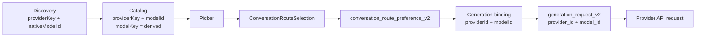

# Model Identity Compatibility Purge Closeout

- **Lifecycle Status**: historical
- **Document Role**: closeout
- **Last updated**: 2026-08-14
- **Authority**: Point-in-time analysis; not an SSOT. Current code and owner decisions take precedence.

---
已完成 Starverse 模型身份兼容层 hard cut。最终风险复核结果：无 P0/P1；未继续设计下一阶段 Provider Identity Registry 或最终语义模型。

## 主要结果

- `RuntimeProviderKey` 已收敛为 [`RuntimeProviderId` (line 1)](../../../src/next/provider/runtimeProviderId.ts#L1)。
- canonical route 定义集中到 [`ConversationRouteSelection` (line 23)](../../../src/next/provider/conversationRouteSelection.ts#L23)。
- [`ChatSessionConfig` (line 45)](../../../src/ui-app/app/chatSessionConfig.ts#L45) 现在只持有顶层 `routeSelection`。
- 生产代码已清除：
  - `selectedProviderId`
  - `selectedModelKey`
  - `CurrentRuntimeSelection`
  - legacy model localStorage cleanup
  - `providerRuntimeSendCoordinator`
  - `src/next/live/*TextChat`
  - `src/constants/providers.ts`
  - send-path `modelId ?? modelKey ?? nativeModelId`
- Picker/Composer/Console 只传 canonical route；selection command 是唯一 mutation authority。失败保持 Picker 打开，快捷选择也会显示错误且不会误记 recent。
- Model Preferences mutation 只接收 `providerKey + modelId`，repository 内部派生并校验 `modelKey`。
- Catalog IPC 只返回 `items`；非法 provider/model/modelKey/observation/count 快照在缓存前整体 fail closed。
- `OpenAI-compatible` 产品功能保留完整。
- Generation V2 request/snapshot/artifact schema、regenerate/edit/retry 语义未改。

新增防回归门禁：[`model-identity-compatibility-purge.mjs`](../../../scripts/gates/model-identity-compatibility-purge.mjs)。

## 当前实际数据流

当前 invariant：

- 当前会话路由唯一持久化 authority 是 `conversation_route_preference_v2`；无 row 即 `routeSelection: null`。
- `modelKey` 只存在于 Catalog/Preferences，是受约束的 `providerKey::modelId`，不进入发送链。
- `nativeModelId` 只保留在 discovery/observation。
- `generation_request_v2.model_id` 是请求选择器。
- provider 实际报告的 model/provider 仍保存在 provider-specific terminal artifact；没有被误投影成请求模型。

仍然存在但本轮刻意不统一的 namespace：

| Route IDGeneration V2 execution ID |                 |
| ---------------------------------- | --------------- |
| `anthropic_messages`               | `anthropic`     |
| `lm_studio`                        | `lmstudio`      |
| `local_endpoint`                   | `generic_local` |
| `ollama_local`                     | `ollama`        |

Credential namespace 也仍可能不同，例如 `anthropic_messages` 与 `anthropic`。这属于后续调查范围，本轮没有引入 registry。

## 数据库重建

开发数据库已通过 epoch root lease 和现有 backup-and-recreate authority 执行一次重建，没有直接删除文件。

- 当前数据库：`%APPDATA%\Starverse\workspace\epoch-2\starverse.db`
- 可恢复备份：`%APPDATA%\Starverse\epoch-2-recovery-backups\epoch-2-1786614230714`
- 已确认备份内存在 `starverse.db`。
- journal 已回退并重新推进到 committed。
- `config.json`、provider vault、浏览器 storage、assets、plugins、runtimes 未改变。
- 新数据库包含本次 acceptance smoke 创建的少量验证记录；为遵守“一次 reset”，没有再次清空。

验证覆盖了 unset route、普通/compatible route 持久化与 reopen、template preserve/reset，以及配置和 credential 状态保持。

## 验证结果

- 目标 unit：31 tests passed。
- 目标 integration：27 tests passed。
- 目标 UI：152 tests passed。
- 最终风险补丁回归：
  - Catalog：15/15 passed。
  - Picker/Composer/send：58/58 passed。
- `npx tsc --noEmit --pretty false`：通过。
- `npx vue-tsc --noEmit --pretty false`：通过。
- identity purge gate：通过，`files=843 deleted=11`。
- Generation V2 zero-residual gate：通过，`runners=11 deleted=17`。
- Test partition gate：通过，513 个测试文件全部有唯一 owner。
- `git diff --check`：通过。
- `npm run test:electron-smoke`：通过，包括 DFC attachment smoke。
- 最终只读风险复核：PASS，无 P0/P1。

ABI 状态：

- better-sqlite3 ABI mismatch encountered: no
- Rebuild commands run: `npm run rebuild:node`, `npm run rebuild:electron`
- Current ABI target after task: electron
- Tests retried after rebuild: targeted unit/integration/UI suites and Electron shell smoke
- Electron smoke retried after rebuild: yes
- No native artifacts committed: confirmed

现有 Magika/DFC、credential/security 文档及 macOS workflow dirty changes均保留；没有 staging 或 commit，也没有生成的 `public/build-id.json`/native artifact 出现在 Git 状态中。

按你的边界，本轮到新的只读数据流报告为止，不继续提出或实施最终语义重构。
