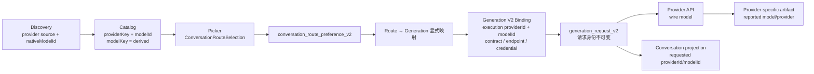

# Model and Provider Identity Semantic Review — ChatGPT 5.6 Sol

- **Lifecycle Status**: historical
- **Document Role**: implementation-note
- **Last updated**: 2026-08-14
- **Authority**: Point-in-time analysis; not an SSOT. Current code and owner decisions take precedence.

---
## 结论

基于当前本地 checkout 的独立源码审查，Starverse 的核心身份链已经基本形成单一 authority：



本轮没有发现旧 `selectedProviderId`、`selectedModelKey` 或 `CurrentRuntimeSelection` 重新进入生产发送链；旧名称仅残留在 purge gate、拒绝兼容数据的测试 fixture，以及普通局部变量名中。发送路径也没有 `modelId ?? modelKey ?? nativeModelId` 一类跨字段降级。

因此不建议为了命名统一而整体重命名 Catalog、Generation V2 或数据库字段。当前最需要解决的是边界语义，而不是词汇一致性。

审查基线：

- 分支：`codex/ci-live-smoke-availability`
- HEAD：`5f2d7433001133430f183590ac7a4432124c6925`
- 工作区：clean
- 仅检查本地 checkout，没有使用远程仓库或旧评审结论
- 本轮未修改代码、未运行测试

## ① 当前实际语义模型

### Discovery → Catalog

Discovery 的 `nativeModelId` 不是未经处理的原始字段，而是 provider-specific decoder 规范化后的“Provider API 可调用模型标识”。例如 Gemini 会优先采用 `baseModelId`，否则去掉 `models/` 前缀。原始响应只以脱敏、限深的 `rawProviderRecord` 形式进入 observation。[providerModelObservationV2.ts (line 19)](../../../src/shared/modelCatalog/providerModelObservationV2.ts#L19)

进入 Catalog 时，当前五个正式 source 都执行：

```
Catalog modelId := observation.nativeModelId
Catalog modelKey := providerKey + "::" + modelId
```

Catalog repo 和 renderer query 均强制校验：

- item `providerKey` 等于当前 Catalog scope provider；
- `modelId` 非空；
- `modelKey` 必须为规范派生值；
- observation provider 一致；
- `observation.nativeModelId === item.modelId`。

证据见 [modelCatalogV2Repo.ts (line 119)](../../../infra/db/repo/modelCatalogV2Repo.ts#L119) 和 [catalogQueryService.ts (line 353)](../../../src/next/modelCatalog/catalogQueryService.ts#L353)。

因此在正式 Catalog 主链上，`nativeModelId` 与 `modelId` 不是两个竞争 identity：

- `nativeModelId` 表示 discovery evidence；
- `modelId` 表示 Catalog authority 对外发布的模型标识；
- 当前二者值相等，并有持久化 invariant 保证。

Catalog snapshot 的 scope 也不只有 `providerKey`，还包含 credential scope、endpoint profile、operation contract 和 category。因此两个相同 `providerKey` 的 snapshot 不一定属于同一个 catalog authority context。

### Catalog → Picker → Conversation Route

当前注册的 Catalog provider 空间是：

```
openrouter
openai_responses
google_ai_studio
anthropic_messages
deepseek
```

注册表见 [providerCatalogRegistry.ts (line 6)](../../../src/shared/modelCatalog/providerCatalogRegistry.ts#L6)。

Picker 对这五个 source 使用相同字面值投影为 `RuntimeProviderId`。另外，`RuntimeProviderId` 还包括三种不依赖正式远端 Catalog 的本地执行入口：

```
lm_studio
ollama_local
local_endpoint
```

定义见 [runtimeProviderId.ts (line 1)](../../../src/next/provider/runtimeProviderId.ts#L1)。

所以 `RuntimeProviderId` 的真实领域含义更接近：

> Conversation/renderer 可选择的 provider route ID

它不是 Generation V2 的通用 execution provider ID。

Picker 提交的唯一正式选择是严格判别联合：

- 普通 provider：`providerId + modelId`
- OpenAI-compatible：完整 `CompatibleConfigurationSelection`

见 [conversationRouteSelection.ts (line 10)](../../../src/next/provider/conversationRouteSelection.ts#L10) 和 [ModelPickerDialog.vue (line 2059)](../../../src/ui-app/components/ModelPickerDialog.vue#L2059)。

普通模型的 `modelKey` 不进入 route。Picker 先等待 app-level command 成功持久化，再关闭 UI，因此 command 是 mutation authority。

Conversation 当前路由只存于 `conversation_route_preference_v2`，通过 revision CAS 更新。[conversationRoutePreferenceV2Repo.ts (line 73)](../../../infra/db/repo/conversationRoutePreferenceV2Repo.ts#L73)

`ChatSessionConfig` 只是加载后的应用视图；conversation meta 不再读写路由。[chatSessionConfig.ts (line 166)](../../../src/ui-app/app/chatSessionConfig.ts#L166)

### Conversation Route → Generation V2

普通 route 的转换是显式且总量有限的：

| Conversation `RuntimeProviderId`Generation V2 execution `providerId` |                     |
| -------------------------------------------------------------------- | ------------------- |
| `openrouter`                                                         | `openrouter`        |
| `openai_responses`                                                   | `openai_responses`  |
| `google_ai_studio`                                                   | `google_ai_studio`  |
| `anthropic_messages`                                                 | `anthropic`         |
| `deepseek`                                                           | `deepseek`          |
| `lm_studio`                                                          | `lmstudio`          |
| `ollama_local`                                                       | `ollama`            |
| `local_endpoint`                                                     | `generic_local`     |
| compatible composite                                                 | `openai_compatible` |

转换位于 [appChatApp.logic.ts (line 7198)](../../../src/ui-app/app/appChatApp.logic.ts#L7198)。

这些差异是 Catalog/UI route family 与 Generation execution/contract family 的边界，并非自动构成语义漂移。

Initial、regenerate 和 edit-resend 都读取当前 conversation route；retry 则根据目标历史回答的 `protocolContractId` 选择执行路径，并从历史 snapshot 恢复 identity。这个差异符合当前产品语义，不应为了“统一”而抹平。

### Generation Binding → Request persistence

Generation V2 binding 固定：

```
execution providerId
endpointProfileId
credentialScopeId
protocolContractId
modelId
operation identity
```

见 [providerBindingV2.ts (line 31)](../../../src/next/generation-v2/domain/providerBindingV2.ts#L31)。

Prepared request 再携带相同 identity、最终 URL、headers/body digest 等。[preparedProviderRequestV2.ts (line 31)](../../../src/next/generation-v2/compiler/preparedProviderRequestV2.ts#L31)

`generation_request_v2` 将这些字段不可变持久化；repo 会把 prepared request 与 snapshot binding、capability authority 逐项比较。[generationRequestV2Repo.ts (line 348)](../../../infra/db/repo/generationRequestV2Repo.ts#L348) [generationExecutionSchema.sql (line 338)](../../../infra/db/v2/generationExecutionSchema.sql#L338)

这里的多层重复是有意的审计 invariant，不是多个独立可写 authority。

尤其是：

> `generation_request_v2.model_id` 始终是 requested model/selector，不会被 Provider 回包的模型覆盖。

Conversation history projection同样读取第一条 request row 的 provider/model，而不是 terminal artifact。[conversationReadV2Repo.ts (line 397)](../../../infra/db/repo/conversationReadV2Repo.ts#L397)

### API wire 与 reported identity

| Provider family`modelId` 如何发送回包模型处理 |                                 |                                                                   |
| ----------------------------------- | ------------------------------- | ----------------------------------------------------------------- |
| OpenRouter chat                     | JSON `model`                    | reported `model` 和 downstream `provider` 存 native artifact，可与请求不同 |
| OpenRouter images                   | JSON `model`，另有 `provider.only` | 不保存 resolved upstream model/provider                              |
| OpenAI Responses                    | JSON `model`                    | reported model 存 terminal artifact，不要求相等                          |
| Anthropic                           | JSON `model`                    | reported model 存 native artifact，不要求相等                            |
| Gemini GenerateContent              | URL `/models/{model}:...`       | `modelVersion` 存 response artifact                                |
| Gemini Interactions image           | JSON `model`                    | 要求回包模型等于请求模型                                                      |
| DeepSeek                            | JSON `model`                    | reported model 存 terminal artifact，不要求相等                          |
| OpenAI-compatible                   | JSON `model`                    | 要求相等                                                              |
| LM Studio                           | JSON `model`                    | 要求相等                                                              |
| Generic local                       | JSON `model`                    | 要求相等                                                              |
| Ollama                              | JSON `model`                    | 要求相等                                                              |

例如 OpenRouter reported identity 位于 [terminalArtifactV1.ts (line 5)](../../../src/next/generation-v2/providers/openrouter/terminalArtifactV1.ts#L5)，OpenAI 位于 [terminalArtifactV1.ts (line 11)](../../../src/next/generation-v2/providers/openai-responses/terminalArtifactV1.ts#L11)。

所以 requested model 与 reported/resolved model 是两个真实领域概念。当前 UI 展示 requested selector，例如 OpenRouter `auto` 仍显示 `auto`，即使 native artifact 已记录实际路由模型。

## Provider 身份空间总表

| 领域空间字段/类型实际含义       |                                    |                                        |
| ------------------- | ---------------------------------- | -------------------------------------- |
| Catalog source      | `providerKey`                      | 模型目录来源及 scope 维度                       |
| Conversation route  | `RuntimeProviderId` / `providerId` | 当前会话可选择的执行入口                           |
| Generation V2       | binding/request `providerId`       | contract/runtime execution family      |
| Credential storage  | `ProviderCredentialKey`            | 密钥存储与 lease 查询 key                     |
| Compatible provider | `providerInstanceId`               | 用户创建的具体 provider/config instance       |
| OpenRouter response | `provider`                         | OpenRouter 实际选择的下游 provider            |
| Endpoint routing    | `providerTag/providerSlug`         | OpenRouter image endpoint/provider 选择器 |

Credential key 的正式空间是：

```
openrouter
openai_responses
google_ai_studio
anthropic
deepseek
```

定义见 [providerCredentialContract.ts (line 1)](../../../electron/credentials/providerCredentialContract.ts#L1)。Catalog authority 已明确处理 `anthropic_messages → anthropic` 等映射。[providerCatalogAuthorityRegistryV2.ts (line 28)](../../../src/next/modelCatalog/providerCatalogAuthorityRegistryV2.ts#L28)

Credential settings 返回的 `providerId='openai'`、`providerId='google-ai-studio'` 属于诊断/status contract，而不是 Generation route identity。[generationV2CredentialSettingsIpc.ts (line 25)](../../../electron/ipc/generationV2CredentialSettingsIpc.ts#L25)

## 模型字段 invariant

| 字段当前真实含义                    |                                                                                       |
| --------------------------- | ------------------------------------------------------------------------------------- |
| `nativeModelId`             | Discovery 规范化后的 provider-callable identity；属于 observation/evidence                    |
| Catalog `modelId`           | Catalog authority 发布的 provider-scoped model identity；当前严格等于 `nativeModelId`           |
| Route `modelId`             | 用户当前请求的模型/selector                                                                    |
| Generation `modelId`        | binding、prepared request、request row 中的 requested identity                            |
| `modelKey`                  | `${providerKey}::${modelId}` 的派生复合键，用于 Catalog/prefs/UI key，不是 Provider wire identity |
| reported model/modelVersion | Provider 回包事实，保存在 provider-specific artifact                                          |
| Compatible `modelId`        | 必须与 `providerInstanceId` 组合解释，不能放入普通 Catalog provider namespace                       |

`selectedModelId` 当前只是若干组件内部的局部变量名，不是持久化或 wire contract。

## ② 仍存在的真实问题

### 1. OpenAI-compatible route 的“固定版本”与实际执行不一致

这是当前最重要的语义问题。

持久化 selection 包含：

- `endpointRevisionId`
- `credentialVersionRef`
- request/response profile ID 与 version
- reasoning mapping ID/version
- inline policy ID/version
- `extraBody`

见 [compatibleConfigurationSelection.ts (line 5)](../../../src/next/provider/openai-chat-compatible/ui/compatibleConfigurationSelection.ts#L5)。

但 initial/regenerate/edit command 只传 `providerInstanceId + modelId + extraBody`。Coordinator 随后读取当前 `endpointRevisions[0]` 和当前 configuration，而不是 selection 中持久化的 revision。[openAIChatCompatibleGenerationV2Coordinator.ts (line 104)](../../../electron/services/openAIChatCompatibleGenerationV2Coordinator.ts#L104)

结果是：

- route row 看起来像“固定配置 provenance”；
- 实际发送行为却是“使用 provider instance 的当前配置”；
- Generation snapshot/request 会正确记录实际使用的新配置，因此审计链没坏；
- 但 route preference 的字段含义不诚实。

最合理的下一步不是机械补传全部字段，而是先决定产品语义：

- 若 route 是 pinned selection：执行必须精确消费这些 revision；
- 若 route 是 current intent：应缩小 selection，仅持久化稳定 instance/model/config reference，把确切 revision 留给 Generation snapshot。

结合当前 regenerate 使用当前配置、retry 使用历史 snapshot 的设计，我更倾向第二种。

### 2. Google active-catalog authority 写入错误 namespace

[activeCatalogModelAuthorityV2Service.ts (line 173)](../../../electron/services/activeCatalogModelAuthorityV2Service.ts#L173) 将 `google_ai_studio` 转成 `gemini`，但当前 reviewed contract、binding 和 request 均使用 `google_ai_studio`。

现有 Gemini composer 没有使用该 authority 字段，因此尚未形成现时发送错误；但一个标记为 trusted/verified 的对象内部 identity 已不一致。这是高确定性的 P2，应通过 registry-wide invariant 修正，而不是新建更多 alias。

### 3. 历史 execution provider 被错误声明为 `RuntimeProviderId`

Conversation read 返回的是 Generation execution namespace，例如：

```
anthropic
lmstudio
ollama
generic_local
openai_compatible
```

UI 却将其直接 cast 为 `RuntimeProviderId`。[appChatApp.logic.ts (line 2273)](../../../src/ui-app/app/appChatApp.logic.ts#L2273)

当前 retry 依赖 `protocolContractId`，所以没有误路由；但类型上表达了非法状态。应引入独立的 `GenerationExecutionProviderId`，或保持明确命名的 validated string，不能继续假装它属于 conversation route namespace。

### 4. Model Preferences 接受开放 provider string，UI 再强制 cast

Catalog 公共 `CatalogProviderKey` 当前是 `string`。[catalogIdentity.ts (line 1)](../../../src/shared/modelCatalog/catalogIdentity.ts#L1)

Preferences IPC/repo 也允许任意非空 providerKey，Composer 随后直接 cast 为闭合 `RuntimeProviderId`。[ChatAppComposer.vue (line 628)](../../../src/ui-app/components/ChatAppComposer.vue#L628)

正常 UI 不会写入非法值，但损坏、导入或未来扩展数据可能在 quick-selection constructor 处产生未捕获 rejection。应在 preferences → route 边界验证或过滤，不必收窄整个 Catalog 公共类型。

### 5. Recents 的持久化和事件语义不一致

当前 production hydration 只加载 favorites，没有读取持久化 recents。[ChatAppComposer.vue (line 721)](../../../src/ui-app/components/ChatAppComposer.vue#L721)

同时 recents 会在：

- Picker 选择时记录；
- 成功 initial/edit send 后再次记录。

因此 `useCount` 混合了“选择次数”和“成功使用次数”，一次正常交互可能计两次。需要先定义 recents 究竟代表 selection、attempt 还是 successful execution，再保留单一记录点。

### 6. Favorites 数据模型泛化，但 UI 仍是 OpenRouter-only

Preferences schema 可保存任意 provider/model pair，但 Picker 的 favorite toggle 只支持 OpenRouter。这可能是产品范围限制；若是，应在 API/类型上明确限制，而不是维持“通用存储、局部 UI”的模糊状态。

### 7. 少量兼容形状仍残留，但不影响发送 authority

两个低优先级残留：

- Catalog sync executor 仍接受内部 `providerResult.models` 作为 `items` fallback：[generationV2ModelAvailabilityIpc.ts (line 347)](../../../electron/ipc/generationV2ModelAvailabilityIpc.ts#L347)
- UI Catalog projection 同时填充相等的 `nativeModelId` 与 `modelId`：[appChatApp.logic.ts (line 3265)](../../../src/ui-app/app/appChatApp.logic.ts#L3265)

它们没有重建旧发送语义，但会继续制造“是不是两个模型 ID”的阅读噪声，可以作为普通清理处理。

## ③ 应保留的差异

这些差异有真实领域含义，不应强制统一：

- Catalog `providerKey` 与 Generation execution `providerId`
- `RuntimeProviderId` 与 execution provider family
- `ProviderCredentialKey` 与 Catalog provider
- `providerInstanceId` 与固定的 `openai_compatible` execution family
- requested `modelId` 与 reported/resolved model
- discovery `nativeModelId` 与 Catalog authority `modelId`
- `credentialScopeId`、`endpointProfileId`、`protocolContractId` 等审计身份
- OpenRouter returned provider、image `providerTag/providerSlug` 与 Starverse provider identity
- regenerate/edit 使用当前 route，与 retry 使用历史 snapshot
- binding/prepared request/request row 之间受 invariant 约束的身份重复
- 数据库中的受约束 `modelKey`；它可服务索引、排序和行 identity，但不能进入发送接口

## ④ 若继续重构，最值得做什么

推荐按价值排序：

1. 先决定 OpenAI-compatible route 是“当前意图”还是“固定配置”；我倾向前者，并把确切 revision 仅留在 Generation snapshot。
2. 修正 `google_ai_studio → gemini` active-authority 不一致，加全 registry 对齐测试。
3. 增加独立的 `GenerationExecutionProviderId` 类型，移除 history projection 中的 `RuntimeProviderId` cast。
4. 在 preferences → quick route 边界验证 `RuntimeProviderId`；同时明确 favorites/recents 支持哪些 provider。
5. 定义 recents 的唯一事件语义并真正 hydrate SQLite 数据。
6. 只有产品需要展示“实际运行模型/Provider”时，才设计统一 reported-provenance read model；绝不能覆盖 `generation_request_v2.model_id`。
7. 删除 `models` alias 和 UI 双 `nativeModelId/modelId` 投影等低风险噪声。

最推荐的长期模型不是一个把所有名称揉在一起的全局 Provider Registry，而是保留四个明确空间，并提供小而总量封闭的转换：

```
CatalogProviderKey
ConversationProviderId / RuntimeProviderId
GenerationExecutionProviderId
ProviderCredentialKey
CompatibleProviderInstanceId
```

模型引用分别保持：

```
CatalogModelRef       = providerKey + modelId
ConversationModelRef  = providerId + modelId
Generation binding    = execution providerId + modelId + contract/endpoint/credential
modelKey              = derived
reported model        = response provenance
```

这能提高类型安全并减少误用，同时不需要改 Generation V2、Catalog snapshot、credential storage 或数据库历史列名。当前架构真正需要的是把边界写实，而不是把不同领域统一命名。
