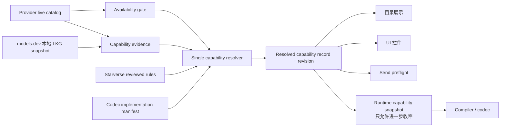

# models.dev 与统一模型能力解析：Codex GPT-5.6 sol 调查

- Lifecycle Status: historical

- Document Role: implementation-note, candidate-action-list

- Last updated: 2026-08-16

> 从原始汇编文档机械拆分的独立调查报告。结论是特定时间点的证据，不是当前代码或外部事实的权威来源；实施前必须复核当前 checkout 与官方资料。

## 调查结论

建议接入 models.dev，但前提是先收敛 Starverse 现有 capability authority。

最合理的定位是：

> models.dev 是版本化的、provider-scoped 的 capability evidence source；它不负责模型可用性，不直接驱动 UI，也不直接授权 compiler。

真正的最终 authority 应是 Starverse 自己的单一 resolved capability 记录。目录、UI、preflight、runtime snapshot、compiler 全部消费它；compiler/codec 只提供 wire implementation 上限，不能扩权。

当前 DeepSeek 问题证实了用户的判断：UI 与发送前校验现在不是同一来源。models.dev 可以补齐 `/models` 缺失的 reasoning 证据，但仅接入 models.dev 并不能自动消除这条分叉。



models.dev 没有通向 availability gate 的路径。

### 1. 是否建议接入 models.dev？

建议接入，理由有三点：

- DeepSeek、OpenAI 等 `/models` 接口经常只证明模型存在，不提供完整 capability。

- models.dev 已有 provider-specific model、reasoning options、modalities、limits 等结构，schema 也明确区分 reasoning toggle、effort、budget。[models.dev README](https://github.com/anomalyco/models.dev)、[schema.ts](https://github.com/anomalyco/models.dev/blob/dev/packages/core/src/schema.ts)

- Starverse 已具备 observation、resolution digest、catalog revision、runtime capability snapshot、LKG 和 stale rejection，适合把它作为新证据源接入。

但它应在统一 resolver 完成或至少进入 shadow mode 后接入。否则很容易变成新的 UI fallback，增加第四套能力表。

### 2. models.dev 最合理的角色

定义为：

> `trusted_external_catalog_evidence`：可用于填补 live provider 的 `missing/unknown`，但不能覆盖同一 serving scope 下 provider 的明确事实，也不能绕过 reviewed policy 或 codec 上限。

它可以证明“有证据认为该 provider 下该模型支持某能力”，但不能单独证明：

- 当前 credential 看得到模型；

- 当前 endpoint/profile 提供该模型；

- Starverse 当前 operation 支持该能力；

- Starverse codec 已经实现对应编码。

models.dev 自己也采用 provider model + `base_model` 继承，并允许 provider-specific override，这一点与 Starverse 的 provider isolation 要求基本相符。[models.dev metadata 规则](https://github.com/anomalyco/models.dev#adding-model-metadata)

### 3. 应该在哪一层接入？

推荐接在现有 capability resolution 边界，而不是：

- DeepSeek catalog source；

- UI；

- active preflight；

- provider compiler；

- 每次发送前的联网请求。

具体来说，应把当前 [modelCapabilityResolverV2.ts](../../../src/next/modelCatalog/modelCapabilityResolverV2.ts:15) 从“provider observation + 简单 supplement”升级为接受完整 evidence bundle 的纯 resolver：

```text

live provider observation

+ models.dev provider-specific record

+ reviewed capability rules

+ codec implementation manifest

→ one resolved capability record

```

最终记录应在 active catalog publication 时物化并纳入 digest/revision。现有 catalog scope 已包含：

- provider

- credential scope

- endpoint profile

- operation contract

- category

见 [modelCatalogV2Repo.ts](../../../infra/db/repo/modelCatalogV2Repo.ts:11)。这已经非常接近所需的 capability identity。

Runtime capability snapshot 不应重新决定模型能力；它只能从上述记录出发，叠加工具注册表、附件、确认状态等 command-specific 条件做单调收窄。

### 4. 当前到底有多少个模型能力决策点？

按 DeepSeek reasoning 链路计算，至少有 9 个实现 seam，其中 6 个会独立影响业务可见性或合法性：

| # | 当前 seam | 现状 | 目标 |

|---|---|---|---|

| 1 | Provider observation parser | DeepSeek 所有 capability 都写成 `missing` | 保留，忠实表达来源 |

| 2 | Catalog 顶层布尔投影 | `missing` 被投影成 false-like boolean | 删除其 authority 身份 |

| 3 | Model capability resolver/registry | 只补 `textChat`，reasoning 仍 unknown | 升级为唯一 resolver |

| 4 | Query/picker fallback | resolution 缺失时回退旧 booleans | 移除 fallback |

| 5 | UI selector/session guard | Composer、Console 各自 hardcode | 只消费 resolved domain |

| 6 | Active catalog preflight | 按 bool resolution 拒绝 | 消费同一完整 resolved record |

| 7 | Provider stable capability policy | 再维护一套 effort/domain | 变成 reviewed rules + wire manifest 输入 |

| 8 | Compiler intent projection | 再决定 effort 是否接受和如何映射 | 只做已授权 intent 的编码 |

| 9 | Request codec | 校验最终 wire schema | 保留为最后安全边界 |

关键代码包括：

- DeepSeek observation：[deepSeekModelSource.ts](../../../src/next/provider/deepseek/deepSeekModelSource.ts:254)

- 当前 resolver：[modelCapabilityResolverV2.ts](../../../src/next/modelCatalog/modelCapabilityResolverV2.ts:23)

- 当前 supplement/wire 表：[providerCatalogAuthorityRegistryV2.ts](../../../src/next/modelCatalog/providerCatalogAuthorityRegistryV2.ts:66)

- catalog fallback：[catalogQueryService.ts](../../../src/next/modelCatalog/catalogQueryService.ts:404)

- Composer 静态 DeepSeek 选项：[ChatAppComposer.vue](../../../src/ui-app/components/ChatAppComposer.vue:373)

- Console 的另一套 `low/medium/high`：[ChatSessionConsole.vue](../../../src/ui-app/components/ChatSessionConsole.vue:2271)

- active preflight：[activeCatalogModelAuthorityV2Service.ts](../../../electron/services/activeCatalogModelAuthorityV2Service.ts:65)

- runtime policy：[stableCapabilityPolicyV2.ts](../../../src/next/generation-v2/providers/deepseek/stableCapabilityPolicyV2.ts:216)

- compiler projection：[generationIntentProjectionV2.ts](../../../src/next/generation-v2/domain/generationIntentProjectionV2.ts)

- wire codec：[chatRequestV1.ts](../../../src/next/generation-v2/providers/deepseek/chatRequestV1.ts:36)

### 5. 哪些 capability hardcode 应删除或收敛？

应收敛到 resolver/rule registry：

- `DEEPSEEK_SELECTABLE_REASONING_EFFORTS`

- `ChatSessionConsole` 的 `low/medium/high`

- catalog query/picker 的 legacy capability boolean fallback

- `BOOLEAN_WIRE_IMPLEMENTED` 这种全 provider 统一 true 的粗粒度表

- DeepSeek stable policy 中的模型能力与 semantic effort domain

- OpenAI Responses 的 model regex capability 表

- Anthropic exact-model thinking table

- Gemini family thinking rules

- compiler 中会扩大 semantic domain 的 provider/model allowlist

这些事实可以继续以 reviewed evidence/rules 的形式存在，但不能继续由各消费层分别读取。

### 6. 哪些 provider-specific hardcode 应保留？

以下属于合理的 protocol/wire knowledge：

- `reasoning.mode → thinking.type`

- `reasoning.effort → reasoning_effort`

- provider request 字段名和 JSON shape

- disabled 时是否禁止或省略 effort

- thinking 模式下哪些 sampling 字段无效

- tool choice 约束

- tool-call 后 `reasoning_content` 的回传规则

- endpoint contract ID、角色映射、closed decoding

- 最终 wire enum 和 request schema 校验

兼容 alias 映射也可以保留，但只能放在“兼容输入归一化”边界；它不能进入 UI 展示的原生能力 domain，也不能让 compiler 扩权。

### 7. 怎样保证没有两套 capability authority？

需要建立四条强约束：

1. 只有 resolver 可以从 evidence 得出 capability。

2. UI 不接受 provider 静态列表，只接受 `resolvedCapability.domain`。

3. Preflight 使用同一 capability revision/hash。

4. Compiler 必须拿到并验证该 snapshot，只能编码 snapshot 已授权的 semantic intent。

最终 compiler 的职责应是：

```text

assert intent ⊆ resolved snapshot

→ encode semantic field

→ validate final wire request

```

而不是：

```text

根据 provider/model 再推测一次是否允许

```

`RuntimeCapabilitySnapshotV2` 已经有 evidence digest、semantic fields digest、revision、snapshot hash 和 catalog authority 六元组，可以直接复用。[runtimeCapabilitySnapshotV2.ts](../../../src/next/generation-v2/capability/runtimeCapabilitySnapshotV2.ts:219)

建议扩展它的 evidence kind，加入 `trusted_external_catalog`；同时显式增加 `unknown`，避免当前 `unavailable` 混合“无法证明”和“明确不可用”。

### 8. 冲突语义

首先必须区分：

- `missing`：某个来源没有该字段，是 source-level observation。

- `unknown`：汇总后仍无法证明支持或不支持。

- `unsupported`：有明确 negative evidence 或 reviewed deny。

- `not_implemented`：模型可能支持，但 Starverse codec 尚未实现。

- `executable`：支持、规则允许、codec 可编码三者同时成立。

推荐冲突矩阵：

| 情况 | 结果 |

|---|---|

| Live 有新模型，models.dev 没有 | 模型 active；外部 metadata 视为 missing，不能据此说 unsupported |

| models.dev 有模型，live catalog 没有 | 不 active，不可发送 |

| Live capability 字段 missing，models.dev 支持 | 可作为正向补充，仍需 reviewed rules 与 codec 交集 |

| Live 明确 false，models.dev true | 同 scope 下 live false 胜出；记录 conflict |

| Live 明确 true，models.dev false | live true 胜出；记录第三方 metadata drift |

| Reviewed rule 与 models.dev 冲突 | reviewed rule 胜出 |

| models.dev 支持，但 codec 未实现 | `modelSupport=supported`，`executable=false` |

| 两个非权威证据互相矛盾且无 adjudication | `unknown`，UI 不开放，preflight fail closed |

| 同一模型由 DeepSeek/OpenRouter 提供 | 分别解析，不共享 provider capability |

Reviewed deny/narrow 应当总能收窄；reviewed add 默认只允许填补 `missing/unknown`，不得覆盖 live explicit false。若将来确实需要覆盖 provider 的明确 negative，应该设计单独的高权限例外类型，而不是普通规则。

另有一个当前代码风险：如果 active catalog 找不到模型，[withExactActiveModel](../../../electron/services/activeCatalogModelAuthorityV2Service.ts:163) 会合成 missing observation，而不是直接判定模型不存在；因为 `textChat` 有 supplement，纯文本请求仍可能通过。这个行为与“live provider 决定 availability”并不完全一致，建议 Owner 明确冻结并倾向改成严格 membership；离线时可以使用 provider catalog 的 LKG，但不能使用 models.dev 代替 availability。

### 9. Reviewed capability rules 设计

建议规则至少包含：

```text

ruleId

ruleRevision

match:

  providerKey

  nativeModelId

  protocolContractId?

  operation?

conditions:

  sourcePresence?

  sourceRevision/digest?

effects:

  denyCapability

  allowWhenMissing

  addEnumValueWhenMissing

  removeEnumValue

  intersectEnumDomain

  clampRange

provenance:

  kind: official_correction | product_narrowing

  sources

  rationale

  reviewedBy

  reviewedAt

  reviewAfter?

```

约束：

- 第一阶段只允许 exact provider + exact model，暂不开放宽泛 regex。

- overlapping rules 必须在 registry validation 时拒绝，不能依赖任意 priority 数字。

- `add` 只能使 model-support evidence 成立，最终仍与 codec manifest 求交。

- 模型不在 live active catalog 时，任何规则都不能创建 availability。

- product narrowing 与 factual correction 必须分别标记。例如当前若移除 DeepSeek `low`，应该说明这是 Starverse 产品收窄，而不是宣称官方不支持。

### 10. DeepSeek 当前 bug 应怎样解决？

当前失败链已经确认：

1. Composer 静态允许 `high/max`。

2. semantic intent 产生 `reasoning.mode=enabled, effort=high`。

3. DeepSeek `/models` parser 将 reasoning 记为 `missing`。

4. resolver 没有 reasoning supplement，得到 `unknown + enabled=false`。

5. active catalog guard 在 compiler 之前抛出

   `GENERATION_V2_ACTIVE_CATALOG_OBSERVATION_INVALID`。

6. 关闭 reasoning 后不再要求该 capability，因此发送通过。

所以不是 DeepSeek HTTP API 拒绝，也不是 codec 无法编码 `high`。

#### 当前官方事实

截至本次调查，DeepSeek 当前官方 API reference 和思考模式页均写明：

- V4 Pro 与 V4 Flash 原生 effort：`low/high/max`

- `medium → high`

- `xhigh → high`

- thinking 默认开启，默认 effort 为 `high`

见 [Chat Completions API](https://api-docs.deepseek.com/api/create-chat-completion/) 和 [思考模式](https://api-docs.deepseek.com/zh-cn/guides/thinking_mode/)。

而当前 Starverse：

- wire codec 只接受 `high/max`

- stable policy 将 `low/medium/high → high`

- 将 `xhigh/max → max`

因此 Starverse 的 alias 规则已经落后于当前官方文档，尤其是 `xhigh → max` 与当前官方 `xhigh → high` 不一致。

models.dev 本身也展示了滞后：

- [V4 Pro 条目](https://github.com/anomalyco/models.dev/blob/dev/providers/deepseek/models/deepseek-v4-pro.toml) 仍是 `high/max`

- [V4 Flash 条目](https://github.com/anomalyco/models.dev/blob/dev/providers/deepseek/models/deepseek-v4-flash.toml) 是 `low/high/max`，并称它与 Pro 不同

- models.dev README 仍概括 DeepSeek V4 为 `high/max`

自然解决方式是：

- Live catalog 只证明 V4 Pro/Flash 当前可见。

- models.dev/官方 reviewed evidence 补充 reasoning support。

- Owner policy 决定 Starverse 当前是否只暴露 `high/max`。

- 当前 codec 只实现 `high/max`，所以即使外部证明 `low` 原生存在，最终 executable domain 仍只能是 `high/max`。

- 若未来要开放 `low`，必须先扩展并测试 codec，再更新 implementation manifest。

- `medium/xhigh` 不进入 UI；若为旧配置保留兼容，应先按当前官方规则归一化。

因此，models.dev 适合辅助解决这一类 observation gap，但真正修复点是统一 resolver 和消费链。

### 11. 更新、缓存、离线与 provenance

不应在发送时访问 models.dev。

推荐：

- 首版优先使用随应用发布的 pinned snapshot。

- 后续增加后台更新器。

- 全量下载后做 schema、大小、provider/model identity 校验。

- 以内容 SHA-256 作为本地 revision。

- 保存 upstream commit/ETag/Last-Modified（若存在）、fetchedAt、validatedAt、parserVersion。

- 更新失败保留 last-known-good。

- 无 LKG 时视为 external evidence missing，不影响 live availability。

- 超过 Owner 冻结的 max-stale 后，只有 models.dev 支撑的正向能力应降为 `unknown`；不要伪装成 unsupported。

- 更新必须原子发布为新的 immutable catalog/capability revision。

Starverse 已经具备：

- catalog immutable snapshot 和 `authorityRevision`

- sync 失败保留 active LKG：[modelCatalogV2Repo.test.ts](../../../infra/db/repo/modelCatalogV2Repo.test.ts:58)

- renderer stale request/revision 拒绝

- active catalog precommit 重验

- immutable runtime capability snapshot：[runtimeCapabilityV2Repo.ts](../../../infra/db/repo/runtimeCapabilityV2Repo.ts:98)

UI 打开期间发生更新时：

- 新 capability snapshot 原子发布并增加 revision。

- UI 刷新展示新 revision。

- 用户点击发送时携带 expected revision。

- revision 已变则返回明确的 capability-changed 错误并刷新控件。

- generation command 一旦创建，就绑定 immutable runtime snapshot hash；compiler 必须使用该 snapshot，不能读取更新后的另一份 capability。

本环境未能直接读取部署中的 `https://models.dev/api.json`，因此“当前部署 API 是否与 GitHub `dev` 完全同步”仍为待核验；架构不能假定二者同步。

### 12. 最小风险迁移路径

1. **先修 convergence，不接外部源**

   为 DeepSeek 增加 reviewed missing-fact evidence；Composer、Console 和 preflight 消费同一 resolution。保留 fail-closed。

2. **定义 rich resolver 与 codec manifest**

   把 boolean capability 扩展为 domain/range/constraints/provenance。先 shadow-run，不改变行为。

3. **models.dev LKG shadow 接入**

   只做 exact provider/model 匹配，记录与现有决策的 diff/conflict，不驱动 UI 或发送。

4. **物化统一 resolved capability**

   纳入 active catalog snapshot、resolution digest、rules revision、codec revision、models.dev digest。

5. **切换目录、UI、preflight**

   删除 legacy boolean fallback 和 provider 静态 selector。

6. **切换 runtime authority/compiler**

   Provider authority 只做运行时收窄；compiler 必须验证 snapshot，不再维护模型 effort allowlist。

7. **逐 provider 推进**

   DeepSeek 首先；随后 Anthropic/Gemini/OpenAI Responses；OpenRouter 最后，因为 relay provider 和 route-specific metadata 最复杂。

关键验收不应只是单元测试，而应包含一条结构性不变量：

> 对同一 capability revision，UI 展示的每个值都必须通过 preflight，且每个 preflight 接受的值都必须由 codec 成功编码；compiler 对任何未授权值必须拒绝。

### 13. 哪些问题必须由 Owner 决定？

最重要的是：

- active catalog 未列出模型时是否允许 reviewed contract fallback；

- reviewed add 能否覆盖 provider explicit false；

- DeepSeek 当前是否产品性地隐藏官方原生 `low`；

- legacy aliases 是拒绝还是归一化；

- stale external-only positive evidence 的最长有效期；

- 首版只随 release 更新还是允许后台更新；

- rich capability schema 是否升级版本；

- metadata 更新时采用 stale reject 还是允许旧 UI 继续基于旧 snapshot 创建命令。

## 建议冻结的架构决策

1. **models.dev 定位**：可信外部证据源，不是 availability authority，也不是最终 capability authority。

2. **唯一最终 authority**：每个

   `provider + credential scope + endpoint profile + protocol contract + operation + native model + evidence revision`

   只能有一份 resolved capability record。

3. **Availability 规则**：只由 provider active catalog/LKG provider catalog 建立；models.dev 和 reviewed rules 均不能创建模型可用性。

4. **严格 provider isolation**：只匹配 models.dev 中 exact provider + native model；`base_model` 只作为该 provider record 明确声明的继承关系使用。

5. **三态语义**：`missing` 是来源状态，`unknown` 是无法决议，`unsupported` 是明确否定；三者不得互相折叠。

6. **冲突优先级**：

   - reviewed deny/narrow 可收窄任何正向证据；

   - live explicit fact 在同 scope 下优先于 models.dev；

   - models.dev 只填补 missing/unknown；

   - reviewed add 默认不得覆盖 live explicit false；

   - codec implementation 是不可绕过的硬上限。

7. **Rules 权限**：规则可以禁用、添加、删除、求交和收窄；添加只在 live 模型存在且 codec 已实现时才可能成为 executable。

8. **UI 规则**：UI 不得读取 provider 静态 capability 表；只显示 resolved capability domain。

9. **Compiler 规则**：compiler 不维护模型能力 allowlist，不扩展 resolved domain；只编码已授权 semantic intent 并校验 wire schema。

10. **Alias 规则**：兼容 alias 不作为原生 UI 档位；只允许在版本化的 compatibility normalization 边界存在。

11. **Revision 规则**：目录、UI、preflight、runtime snapshot 和 compiler 必须绑定同一 capability revision/digest；command 创建后使用 immutable snapshot。

12. **更新规则**：models.dev 不得成为 send-time 网络依赖；采用 validated snapshot、content digest、LKG、原子发布和明确 stale policy。

13. **DeepSeek 当前策略**：在 codec 仍只实现 `high/max` 时，最终 executable domain 保持 `high/max`；是否增加官方当前原生 `low`，必须作为单独的 codec + product policy 决策处理。

14. **迁移顺序**：先统一现有 authority，再接入 models.dev shadow evidence，最后删除各层 hardcode；不得先把 models.dev 直接接到 UI。

本次调查保持只读，未修改代码、未运行测试，也未读取用户运行时数据库；现有未提交工作区内容未被触碰。
