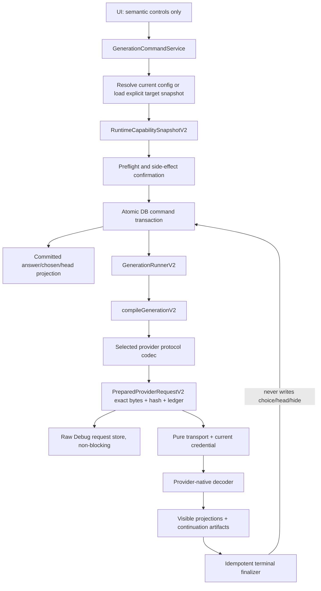

# Generation Compiler V2 — Final implementation plan

Status: Goal 1 complete pending only the explicitly listed Goal 2 prerequisite decisions. Investigation baseline is local `main@6fb6ad59a9cbe7710a0ec6a65c70ae860afbb66b`; branch-only transition evidence is `HEAD@067171a4c4d55f147340677c7e7f046e95311bd0`. Official contracts were verified 2026-07-13 and the OpenRouter Images plus LM Studio decisions were live-qualified 2026-07-14. OpenRouter Images selection is user-owned: valid persisted binding wins, a sole eligible endpoint auto-binds, and multiple eligible endpoints block for explicit selection; every request emits `provider.only:[provider_tag]` plus `allow_fallbacks:false`. LM Studio 0.4.19+ passed the Responses-first item/branch/restart/tool/SSE suite and is fixed to `lmstudio-openresponses`; both Gate 0 blockers are closed while their production adapters remain implementation work.

## Executive decision

Generation Compiler V2 is a destructive, single-cutover architecture:

- one sparse semantic `GenerationConfigV2`;
- one immutable semantic answer snapshot;
- one evidence-revisioned capability binding shared by UI and compiler;
- one compiler entry with exhaustive consumed/rejected disposition;
- one closed typed contract per provider protocol;
- one immutable exact-byte request passed unchanged to Raw Debug and transport;
- one atomic command transaction that switches chosen/head immediately;
- no legacy data, compatibility, dual read/write, fallback, generic wire path, unknown patch, or temporary bridge.

The current main implementation cannot be incrementally extended into this state: it mixes historical route/current UI config and has multiple provider request entries. The current branch adds useful operation/raw/continuation material but its V1 snapshot persists wire patches and it is 54 commits behind main. Goal 2 begins by reconciling these branch inputs onto one main-based implementation branch.

## Target architecture

Unique ownership:

| Fact | Sole owner |
|---|---|
| User generation meaning/inheritance | `GenerationConfigV2` + resolver |
| Model/endpoint-set or pinned-endpoint/protocol/operation support | `RuntimeCapabilitySnapshotV2` and evidence records |
| Answer retry truth | `AssistantAnswerGenerationSnapshotV2` |
| Native wire shape | Selected provider contract codec |
| Exact sent body | `PreparedProviderRequestV2.body` |
| Attempt/sequence/status | generation operation/request/attempt ledgers |
| Native continuation | provider continuation artifacts |
| Current visible branch | transactional `branch_choice` + branch head |
| Credentials | current standard credential service; never snapshot/compiler |
| Debug request body | separate Raw Debug DB fed exact prepared bytes |

## Eight implementation packages

1. [TP1 request chain and legacy](./tp1-request-chain-and-legacy.md) — replace all UI/provider entries with explicit commands and remove inference/fallback.
2. [TP2 data epoch/reset/credentials](./tp2-data-epoch-reset-credentials.md) — epoch-scoped workspace, crash-safe destructive reset, exact credential whitelist.
3. [TP3 semantic config/snapshot/continuation](./tp3-semantic-config-snapshot-continuation.md) — fresh persistence and immutable answer truth.
4. [TP4 capability/evidence/UI](./tp4-capability-evidence-ui.md) — one revision drives controls and compilation.
5. [TP5 compiler/ledger/transport/retry](./tp5-compiler-ledger-transport-retry.md) — exhaustive typed compilation and exact bytes.
6. [TP6 OpenRouter/OpenAI](./tp6-openrouter-openai-contracts.md) — three separate native contracts.
7. [TP7 remaining providers/local](./tp7-provider-contracts.md) — contract per protocol; Gemini provider owns `v1beta` once.
8. [TP8 cutover/tests/Goal 3](./tp8-cutover-tests-goal3.md) — one release switch, zero-residual deletion, AC-01…AC-42.

## Goal 2 execution plan

### Gate 0 — resolve prerequisites

Production implementation may start for an individually closed contract slice. Every unresolved row below blocks its own package/epoch surface and may not be inferred, crossed, or implemented before its ADR entry exists.

### Batch 1 — fresh data foundation

- Correct packaged app identity and implement the frozen `%APPDATA%\Starverse\workspace\epoch-2\starverse.db` root.
- Implement marker/lock/journal/canonical owned delete and exact config credential filter.
- Introduce fresh V2 schema only; remove migrations/legacy ensure functions.
- Make startup complete epoch before DB worker/raw store/IPC/window/jobs.

Acceptance: TP2 crash/path/credential/downgrade suite green on fresh and interrupted profiles.

### Batch 2 — domain and transaction

- Add semantic config persistence/resolver, capability evidence tables/cache, immutable snapshot, continuation artifact, operation/request/attempt ledgers.
- Implement three explicit generation commands plus initial send/edit/continuation commands on one repository transaction seam.
- Port operation idempotency, committed chosen/head/hide invariants, and orphan recovery from branch-only material.

Acceptance: every command creates answer+snapshot+operation+choice/head atomically; failures after commit never roll branch state back.

### Batch 3 — compiler and provider contracts

- Implement exhaustive compiler/prepared bytes/stable serializer and pure transport interface.
- Implement one package per enabled protocol, starting with exact fixtures and capability rules.
- Feed exact bytes to separate Raw Debug store non-fatally; transport receives the same bytes only.

Recommended enablement order: DeepSeek → Anthropic → OpenAI Responses → OpenRouter Chat → OpenRouter Images → fixed Generic/OpenAI Chat → LM Studio/Ollama fixed protocols → Gemini GenerateContent → Gemini Interactions. Both Gemini codecs use provider-owned `v1beta`, but each remains disabled until its own capability fixtures and live smoke pass.

### Batch 4 — UI migration

- Replace provider profiles/regex/fallback enums with capability projection.
- Bind retry buttons only to current chosen answer id.
- On successful command commit, render returned new answer immediately as generating; failed/cancelled/interrupted stays current and diagnosable.
- Display incompatible explicit config and stale revision; never hide/drop it.

### Batch 5 — delete and prove

- Migrate every caller, then delete legacy config owners, snapshot, builders/entries, body fallback, provider switching, compatible unknown paths, old reset and old fixtures.
- Add architecture guards and zero-runtime-hit searches.
- Run TP8 validation order, representative live smokes, and packaged fresh-profile reset.
- Hand the exact diff, tests, body fixtures, reset evidence, and residual audit to Goal 3.

## Generation action invariants

| Action | Config | Target rule | Atomic commit | Terminal invariant |
|---|---|---|---|---|
| Regenerate | current resolved config | question-level | new sibling + chosen/head | old candidate remains; new stays chosen on complete/fail/cancel/interruption |
| Retry as new | exact target V2 snapshot | target must equal current chosen | new sibling + chosen/head | target remains selector candidate; new never auto-rolls back |
| Retry replace | exact target V2 snapshot | target must equal current chosen | branch-local hide + replacement + chosen/head | hidden target remains hidden; replacement stays current in every terminal state |

Stale/invalid target, unsupported/missing snapshot, failed confirmation/preflight, and transaction failure create nothing. Same `operationId` is idempotent; different payload for an existing id is rejected.

## Provider binding summary

| Contract | Endpoint/protocol | Key current decisions |
|---|---|---|
| OpenRouter Chat V1 | `/api/v1/chat/completions` | server web tool only; ordered reasoning/tool artifacts; no chat image generation |
| OpenRouter Images V1 | `/api/v1/images` | user-owned binding by credential/model/image-generation; sole eligible auto-bind, multiple eligible selection-required; exact pin; descriptor-limited options; configurable 6h/24h freshness |
| OpenAI Responses V1 | `/v1/responses` | migrate existing `reasoning.effort/summary`; native web/image tools; one continuation mode; unsupported reasoning rejects |
| Anthropic Messages | `/v1/messages` | exact model rule matrix; ordered native blocks; no image output |
| Gemini GenerateContent | provider contract + `/models/{model}:streamGenerateContent` | provider-owned `v1beta`; independent native codec; no Interactions fallback |
| Gemini Interactions | provider contract + `/interactions` | provider-owned `v1beta`; independent typed codec; no version/operation fallback |
| DeepSeek Chat V4 | `/chat/completions` | typed thinking; reject no-effect sampling; replay reasoning/tool subturns |
| LM Studio OpenResponses | `/v1/responses` | minimum 0.4.19; `store:false`; no `previous_response_id`; complete ordered item replay; fixed `lmstudio-openresponses` binding after exact-body qualification |
| LM Studio OpenAI Chat Completions | `/v1/chat/completions` | only after repeatable Responses contract failure on a healthy runtime and a separate explicit qualification; complete `messages` replay; never runtime fallback |
| Generic/Ollama | profile-pinned protocol | independent bindings; advanced default off; no protocol fallback |

Exact requests and official source URLs are in TP6 and TP7; every field is scoped to its contract/model/operation evidence and verification date.

## Goal 2 fixed constraints and remaining prerequisites

| Owner decision / blocker | Recommended default | Why blocking |
|---|---|---|
| Goal 2 branch base | Rebase/replay branch-only useful changes onto current main without preserving V1/wire patch APIs | Current branches diverge materially. |
| Canonical app identity | Set final Starverse appId/productName before epoch code | Reset root marker cannot be trusted with placeholders. |
| V2 workspace root | Fixed `%APPDATA%\Starverse\workspace\epoch-2\starverse.db`; V2 never opens legacy `chat.db` | Owner-frozen downgrade isolation. |
| Managed runtimes/plugins | Clear with epoch | Registry is erased; preservation requires forbidden migration. |
| Corrupt config credential handling | Block reset/startup and require manual recovery | Prevent silent loss of standard credentials. |
| Preserved config | Exact UI/privacy whitelist plus five encrypted first-party credential leaves; delete notifications and all other config | Prevent ancestor-key leakage and custom credential survival. |
| OpenRouter Images descriptor freshness | Preset `refreshAfter` default 6h, `hardExpireAfter` default 24h, strict inequality; stale-good only before hard expiry | Owner-frozen endpoint truth and availability policy. |
| Beta exposure | Disabled by default; explicit experimental opt-in for OpenRouter beta server tools | Tool exposure is separate from Gemini's fixed API version. |
| Gemini Developer API version | Provider contract owns `v1beta` for all codecs; no table/fallback | Owner-frozen whole-provider version policy. |
| Anthropic rule matrix | Reviewed exact model/version matrix before enablement | Current modes/efforts/sampling vary by model. |
| OpenAI continuation | Prefer client-managed native items for auditability, unless Owner chooses provider-stateful | Modes are mutually exclusive and persist different artifacts. |
| LM Studio protocol | Fixed `lmstudio-openresponses` for the qualified 0.4.19+ endpoint; `/api/v1/chat` forbidden for ordinary multi-turn; Chat Completions only after repeatable contract failure and a separate explicit qualification | Owner-frozen and proven by the 2026-07-14 local exact-body suite; transient/inconclusive failures leave the endpoint unbound, and current implementation must still gain complete item persistence and native SSE decoding. |
| Transport auto retry | Disabled initially | Provider idempotency/cost behavior is not uniform. |
| OpenRouter endpoint descriptor routing | User owns selection; key is `(credentialScopeId, modelId, image_generate)`; valid binding persists, sole eligible auto-binds, multiple eligible returns `OPENROUTER_IMAGE_PROVIDER_SELECTION_REQUIRED`; compiler emits exact pin | Owner-frozen final algorithm. `image_generate` is the canonical V2 domain operation; no alias or dual persistence. No price/order/latency/history/preference selection; stale/mismatch requires rebind plus new command. |
| Image continuation product scope | First release supports only contracts with official native edit/continuation artifacts; otherwise explicit unavailable | Current app only has sibling regenerate. |

Rows marked by an Owner-frozen value are implementation constraints, not unresolved questions. The remaining choices are explicit Goal 2 pre-enable prerequisites and may not be guessed at implementation time.

## Risk register

| Severity | Trigger | Impact | Prevention/detection |
|---|---|---|---|
| P0 | Implement on current branch without main reconciliation | Lost/new code conflicts | Gate 0 ancestry/replay audit. |
| P0 | Same-path DB reset/rollback | Old binary mutates V2 DB | Epoch-scoped root and legacy path never opened. |
| P0 | Generic writer/unknown patch survives | Invalid or unreviewed provider body | Architecture guard and zero-residual deletion. |
| P0 | Transport rebuilds body | Silent semantic loss; Raw mismatch | Prepared-byte-only transport. |
| P0 | Continuation artifact omitted | Provider 400 or changed reasoning/tool behavior | Exact contract artifact fixtures. |
| High | Capability revision races | UI offers field compiler rejects or vice versa | Same revision + transaction stale rejection. |
| High | Reset path ownership error | External file deletion | marker/canonical/reparse guards and sentinels. |
| High | Snapshot written after answer | Unretryable current answer | Single transaction FK/unique invariants. |
| High | Provider docs drift | Wrong field/version | Evidence revision, verification date, blocking conflict policy. |
| High | Retry/network attempt conflation | Duplicate answers/charges | Separate operation/request/attempt ids; auto retry off. |
| High | OpenRouter selected descriptor drifts or pin is omitted/malformed | Router may select an endpoint that cannot honor an exposed image field | Fresh exact descriptor revision, complete-intent validation, typed `provider.only` pin, `allow_fallbacks:false`, and exact-body regression. |
| High | LM Studio Responses is routed through the current Chat Completions mapper or role/text history | Text/reasoning/function items are dropped although HTTP completes | Dedicated `lmstudio-openresponses` codec, complete ordered item artifact, native SSE fixtures, `store:false` guard and architecture test forbidding runtime protocol fallback. |

## Validation and completion

Goal 2 is complete only when:

- TP8 AC-01…AC-42 all pass, with corrected AC-18/19;
- traceability remains 100% after implementation changes;
- zero runtime legacy/compatibility/fallback hits remain;
- no unrelated worktree changes or rebuild artifacts enter the diff;
- Goal 3 reports zero unresolved Critical/High findings.

Goal 1 did not run production tests because it changed planning documentation only. Goal 2 must follow the Node/Electron ABI sequence in TP8.

## Final ADR

Starverse Generation Compiler V2 SHALL resolve one sparse semantic generation configuration into one revisioned provider/model/effective-endpoint-set-or-pinned-endpoint/protocol/operation capability binding, persist an immutable semantic snapshot in the same transaction that creates and chooses the answer, compile through exactly one entry into a closed provider-native request type, exhaustively consume or reject every explicit semantic path, deterministically serialize one immutable body used unchanged by request ledger, Raw Debug, and transport, and persist provider-native continuation artifacts by request sequence. The V2 release SHALL destructively establish an isolated data epoch, preserve only approved encrypted standard credentials and shell preferences, and remove every legacy schema, config owner, request path, generic wire mechanism, unknown patch, dual read/write, fallback, compatibility path, and test fixture. Unsupported, stale, missing, or conflicting evidence SHALL block before transport; no runtime path may infer or silently downgrade semantics.

## Traceability

The [traceability matrix](./traceability-matrix.md) assigns every normative baseline line 14–1917 and all AC-01…AC-42 to the eight package artifacts. Assigned coverage is 100%, uncovered items are zero, and current-official corrections are recorded without losing the original acceptance IDs.
