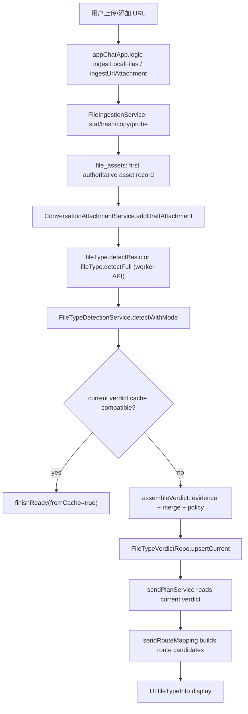
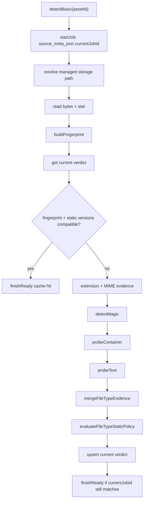
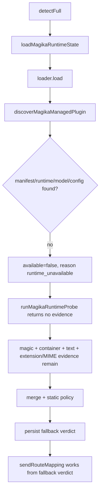
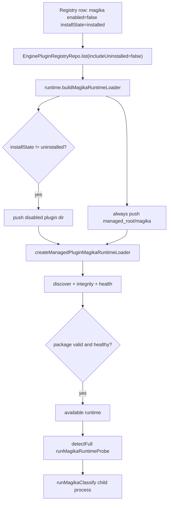
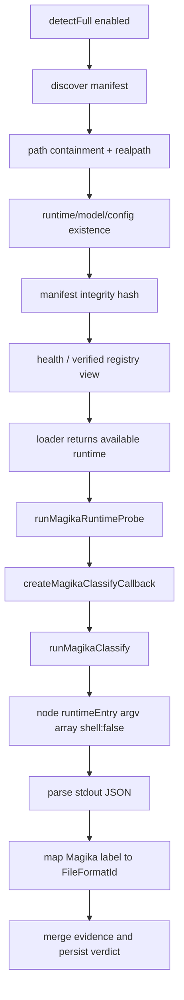
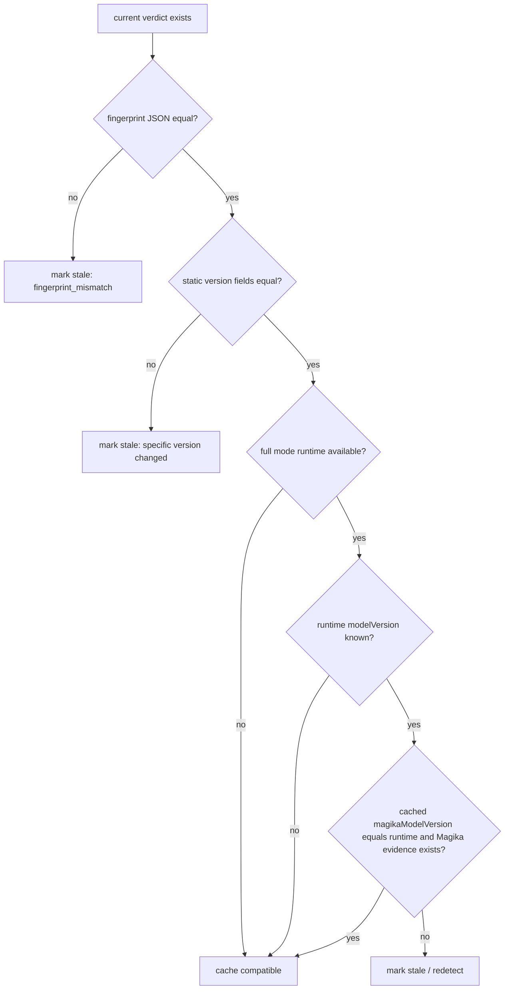
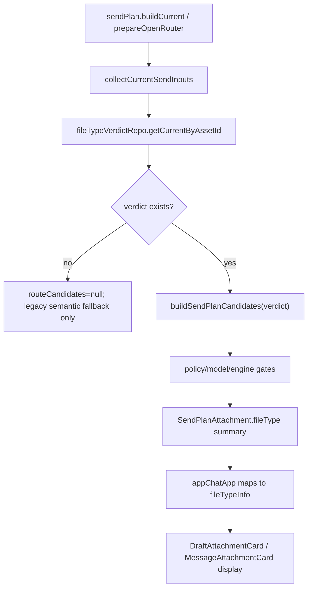
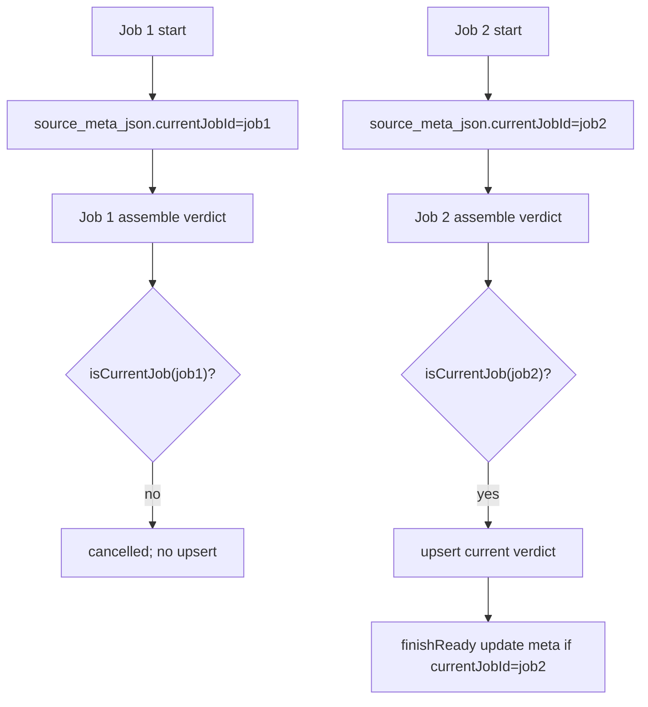

# 58. Magika 状态下文件识别流程审计

**日期**: 2026-05-16  
**HEAD**: `83d37a3`  
**结论**: 阻断。核心 fallback/cache/send-plan 路径基本成立，但“Magika 已安装但禁用”状态存在 P1 正确性缺陷：`detectFull` 的 runtime 目录选择没有按 registry `enabled=true && installState='installed'` 做门控，禁用或失败状态仍可能启动 Magika child process。  
**代码修改**: 无生产代码修改。本文件为审计报告。  
**临时 debug / breakpoint / temporary tests**: 未使用。

本报告只记录本轮代码级审计和文档化结论，不构成生产代码修复声明，也不构成 Document Conversion and Preview 主题的实现验收声明。

## 1. 范围与基线

### 1.1 Preflight

- `git rev-parse --short HEAD`: `83d37a3`
- 初始 `git status --short`:
  - `M public/build-id.json`
  - `M src/next/plugin-distribution/managementViewModel.ts`
  - `M src/ui-app/components/PluginManagementPanel.test.ts`
  - `M src/ui-app/components/PluginManagementPanel.vue`
- `git diff --cached --name-only`: 空。
- `public/build-id.json` 未 staged。
- 上述三个插件管理文件为审计开始前已存在的工作树修改，本报告未修改它们。

### 1.2 阅读过的文档

- `docs/file-pipeline/file-type-detection-implementation/54-file-content-identification-v1-roadmap.md`
- `docs/file-pipeline/file-type-detection-implementation/55-final-spec-coverage-audit.md`
- `docs/file-pipeline/file-type-detection-implementation/56-post-v1-future-phase-roadmap.md`
- `docs/file-pipeline/plugin-distribution/08-real-magika-plugin-operational-smoke.md`
- `docs/file-pipeline/plugin-distribution/11-magika-production-release-closeout.md`
- `docs/file-pipeline/plugin-distribution/07-pdp-phase6-plugin-management-ui-closeout.md`
- `docs/file-pipeline/plugin-distribution/12-plugin-install-operation-state-machine.md` 不存在，已记录。

### 1.3 检查过的主要代码

- 上传 / 摄取：`infra/files/fileIngestionService.ts`, `infra/files/conversationAttachmentService.ts`, `infra/db/repo/fileAssetRepo.ts`, `src/ui-app/app/appChatApp.logic.ts`
- 文件类型检测：`infra/files/fileTypeDetectionService.ts`, `src/next/file-type/types.ts`, `magicDetector.ts`, `textProbe.ts`, `containerProbe.ts`, `evidenceMerge.ts`, `fileTypeStaticPolicy.ts`, `taxonomy.ts`, `taxonomyMap.ts`, `magikaAdapter.ts`, `magikaRuntimeLoader.ts`, `magikaManagedPlugin.ts`, `magikaClassifyRunner.ts`
- cache / persistence：`infra/db/schema.sql`, `infra/db/repo/fileTypeVerdictRepo.ts`, `infra/db/repo/enginePluginRegistryRepo.ts`, `infra/db/migrations/ensureFilePipelineSchema.ts`, `infra/db/migrations/ensureEnginePluginRegistrySchema.ts`
- send route：`src/next/file-type/sendRouteMapping.ts`, `infra/files/sendPlanService.ts`, `src/next/openrouter/openRouterSendPreparation.ts`, `src/next/openrouter/openRouterSendPlanSerializer.ts`
- 插件状态：`infra/files/enginePluginLifecycleService.ts`, `src/next/plugin-distribution/registryModel.ts`, `src/next/plugin-distribution/lifecycleState.ts`, `src/next/plugin-distribution/managementViewModel.ts`, `src/next/file-type/externalEngineAvailability.ts`, `externalEngineHealth.ts`, `externalEngineRegistry.ts`, `officialPluginTrustedRoots.ts`
- UI：`src/ui-app/components/DraftAttachmentCard.vue`, `src/ui-kit/chat/MessageAttachmentCard.vue`, `src/ui-app/components/DraftAttachmentDetailsDialog.vue`, `src/ui-app/components/DraftAttachmentStrip.vue`

### 1.4 运行过的命令和测试

| 命令 | 结果 |
|---|---|
| `git status --short` | 发现既有 4 个 unstaged tracked 变更 |
| `git rev-parse --short HEAD` | `83d37a3` |
| `git diff --cached --name-only` | 空 |
| `npm run rebuild:node` | 通过；为 SQLite/Vitest scoped tests 切换 Node ABI |
| `npx vitest --run src/next/file-type/magikaManagedPlugin.test.ts src/next/file-type/magikaRuntimeLoader.test.ts src/next/file-type/magikaAdapter.test.ts src/next/file-type/magikaClassifyRunner.test.ts infra/files/fileTypeDetectionService.test.ts infra/files/fileTypeDetectionService.fixtures.test.ts src/next/file-type/sendRouteMapping.test.ts infra/files/sendPlanService.test.ts` | 8 files, 138 tests passed |
| `npx vitest --run infra/files/enginePluginLifecycleService.test.ts src/next/plugin-distribution/managementViewModel.test.ts src/ui-app/components/PluginManagementPanel.test.ts` | 3 files, 90 tests passed |
| `STARVERSE_ENABLE_REAL_MAGIKA_TESTS=1 ... npx vitest --run src/next/file-type/magikaClassifyRunner.real.test.ts` | 1 file, 5 tests passed |

`better-sqlite3 ABI mismatch encountered`: no。  
`Rebuild command run`: `npm run rebuild:node`。  
`Current ABI target after task`: node。  
`Tests retried after rebuild`: none; rebuild was run before DB-heavy tests.  
`Electron smoke retried after rebuild`: no。  
`No native artifacts committed`: confirmed; no commit/stage performed in this audit stage。

## 2. 执行摘要

### 2.1 总体结论

当前文件识别体系在“无 Magika 插件”和“Magika 启用且健康”两类路径上证据较完整：上传不依赖 Magika，`detectBasic` 不调用 Magika，`detectFull` 在 runtime 不可用或失败时能 fallback 到 extension/MIME/magic/container/text/evidence merge/static policy，并且 cache freshness 已覆盖 fingerprint 和多个版本字段。

阻断点在“Magika 已安装但禁用”：禁用状态保存在 `engine_plugin_registry.enabled=false`，但 `infra/db/worker/runtime.ts:271-287` 构造 Magika loader 时只排除 `installState='uninstalled'`，没有检查 `enabled`，也没有限制 `installState='installed'`。同时它无条件追加 `engine-plugins/managed_root/magika` fallback 目录。只要物理包仍存在，`detectFull` 仍可能 discover runtime、跑 health check、进入 `runMagikaClassify()` 并 spawn `node` child process。这违反“Magika 禁用时不会被调用”的核心要求。

### 2.2 三种状态简短结论

| Magika 状态 | 审计结论 |
|---|---|
| 无插件 | 通过。runtime loader 返回 unavailable；`detectFull` fallback 可用；上传不受影响；cache 不会因缺失 Magika 永久锁死。 |
| 已安装但禁用 | 阻断。UI/registry 能显示禁用，但 detection runtime gate 未消费 `enabled=false`，禁用包仍可能被调用。 |
| 已安装并启用 | 带 follow-up 通过。discover / path-safe / integrity / health / child-process 安全链路存在，real classify smoke 通过；仍需修复禁用态 gate 以防状态切换期间误调用。 |

## 3. 上传到 verdict 的端到端流程

1. 用户在 UI 选择本地文件或 URL。
2. `src/ui-app/app/appChatApp.logic.ts:4710-4749` 调 `ingestLocalFile()`，或 `4759-4786` 调 `ingestUrl()`。
3. `infra/files/fileIngestionService.ts:124-182` 读取本地文件 stat、文件名、extension、MIME hint、sha256，并复制到 managed storage；`208-277` 处理 URL probe / materialization / link-only。
4. `infra/db/repo/fileAssetRepo.ts:121-149` 创建第一条权威 `file_assets` 记录，包含 `filename`, `extension`, `mime`, `size_bytes`, `asset_kind`, `source_kind`, `storage_backend`, `storage_uri`, `source_meta_json`。
5. `infra/files/conversationAttachmentService.ts:87-102` 把 asset 加入 draft attachment，使用 ingest metadata 推导初始 `aiPayloadKind` / `processingStatus`。
6. 检测入口由 worker handler 暴露：`infra/db/worker/handlers/filePipelineHandlers.ts:184-191` 注册 `fileType.detectBasic` / `fileType.detectFull`。当前 UI send-plan 路径未直接触发这两个方法；它消费已有 current verdict。
7. `infra/files/fileTypeDetectionService.ts:151-232` 读 asset 文件、计算 fingerprint、查 current verdict、做 cache compatibility 判断，未命中时 assemble verdict 并 `upsertCurrent()`。
8. `infra/db/repo/fileTypeVerdictRepo.ts:146-180` 事务化写入新 current verdict，并把旧 current 标记为 non-current；DB partial unique index `idx_file_type_verdicts_asset_current` 保证每 asset 只有一个 current row。
9. `infra/files/sendPlanService.ts:125-168` 读取 current verdict，调用 `buildSendPlanCandidates()` 生成 route candidates，再构造 send plan。
10. `src/ui-app/app/appChatApp.logic.ts:4084-4104` 将 send plan 的 `fileType` summary 映射为 UI `fileTypeInfo`；`DraftAttachmentCard.vue` 与 `MessageAttachmentCard.vue` 只展示该信息。

## 4. detectBasic 流程

`detectBasic()` 是纯内置轻量检测路径。证据：

- `infra/files/fileTypeDetectionService.ts:127-132`: `detectBasic()` 只调用 `detectWithMode('basic')`。
- `infra/files/fileTypeDetectionService.ts:169`: 只有 `mode === 'full'` 才 `loadMagikaRuntimeState()`。
- `infra/files/fileTypeDetectionService.ts:283-290`: 只有 `input.mode === 'full' && input.magikaRuntimeState` 才调用 `runMagikaRuntimeProbe()`。
- `infra/files/fileTypeDetectionService.test.ts:538-576`: 覆盖 `does not invoke magika plugin loader during detectBasic`。

运行 probes：

- extension evidence: `fileTypeDetectionService.ts:245-257`
- OS/browser MIME hint: `259-271`
- magic bytes: `273-274`, `src/next/file-type/magicDetector.ts`
- container probe: `276-277`, `containerProbe.ts`
- text probe: `279-280`, `textProbe.ts`
- evidence merge + static policy: `293-305`

结论：`detectBasic` 不调用 Magika，也不需要查询插件状态。无插件、禁用、启用三种状态下都应完成；其 cache compatibility 只受 fingerprint 和静态版本字段影响。

## 5. detectFull: 无 Magika 插件

无插件时，`infra/db/worker/runtime.ts:271-287` 会构造候选目录；如果目录不存在，`src/next/file-type/magikaManagedPlugin.ts:185-297` 的 discover 返回 `plugin_not_found` / unavailable。`createManagedPluginMagikaRuntimeLoader()` 在 `300-315` 把 discovery unavailable 映射为 runtime unavailable。

`fileTypeDetectionService.ts:322-347` 将 loader unavailable 规整为 `MagikaRuntimeState { available:false }`。`assembleVerdict()` 仍会调用 `runMagikaRuntimeProbe()`，但 `magikaAdapter.ts:41-55` 在 loader unavailable 时直接返回 `evidence:null`，不会进入 runtime classify，也不会 spawn child process。

cache 行为：

- `isModelVersionCacheCompatible()` 在 `fileTypeDetectionService.ts:363` 对 unavailable runtime 返回 true，不因缺失 Magika 强制 invalidation。
- 当以后 runtime 可用且有 modelVersion 时，`363-373` 要求 cached verdict 具备 Magika evidence 且 modelVersion 匹配；否则不复用。
- `infra/files/fileTypeDetectionService.test.ts:924-969` 覆盖 unavailable fallback 不污染 full-mode cache，runtime 恢复后重新检测并写入 Magika evidence。

## 6. detectFull: Magika 已安装但禁用

### 6.1 预期行为

禁用状态应满足：

- 不调用 Magika。
- 不 spawn child process。
- 不阻塞 magic/text/container fallback。
- 不把 disabled 状态永久写成 no-Magika cache。
- UI / diagnostics 可显示 disabled，但不改变 FileTypeVerdict 的核心识别路径。

### 6.2 实际代码行为

存在 P1 缺陷：

- `infra/db/repo/enginePluginRegistryRepo.ts:196-203`: `disable()` 只把 `enabled=0`，不把 `install_state` 改成 `uninstalled`。
- `infra/db/repo/enginePluginRegistryRepo.ts:190-193`: list installed statement 只排除 `install_state='uninstalled'`。
- `infra/db/worker/runtime.ts:277-283`: `buildMagikaRuntimeLoader()` 选择 `engineId === 'magika' && installState !== 'uninstalled'`，没有检查 `enabled`，也没有检查 `installState === 'installed'`。
- `infra/db/worker/runtime.ts:285`: 无条件追加 `engine-plugins/managed_root/magika` fallback 目录。
- `src/next/file-type/magikaManagedPlugin.ts:300-345`: loader 只做 discover + health，不读取 persisted registry enabled state。
- `src/next/file-type/magikaManagedPlugin.ts:454-473` 和 `magikaClassifyRunner.ts:50-98`: classify callback 成功进入时会运行 `node <runtimeEntry> --model-dir ... --config-dir ... --input ... --output-json`。

结论：不能确认“Magika 禁用时不会被调用”。相反，有明确证据表明禁用状态可能仍调用 Magika。这是本报告的阻断项。

## 7. detectFull: Magika 已安装并启用

启用且包有效时，runtime 链路如下：

1. `infra/db/worker/runtime.ts:271-287` 选择候选插件目录。
2. `magikaManagedPlugin.ts:185-297` 读取 `manifest.json`，验证 `engineId === 'magika'`，校验 runtime/model/config 文件存在。
3. `magikaManagedPlugin.ts:674-720` 校验 manifest 文件路径必须是相对路径，禁止绝对路径、`..` 逃逸，并用 realpath 确认不越过 plugin root。
4. `magikaManagedPlugin.ts:546-620` 校验 manifest integrity，要求 runtime/model/config 都有 SHA-256 条目且 hash 匹配。
5. `magikaManagedPlugin.ts:402-431` 注册 manifest 到外部引擎 registry，设置 verification 为 verified，并执行 health check 或无 healthcheck 时 mark healthy。
6. `magikaManagedPlugin.ts:332-345` 返回 available runtime。
7. `magikaAdapter.ts:41-78` 调 `runtime.classify()` 并把 raw output 映射为 Magika evidence。
8. `magikaClassifyRunner.ts:79-92` 使用 `command:'node'`, arg array, `timeoutMs`, `maxStdoutBytes`, `maxStderrBytes` 调外部进程。
9. `externalProcessRunner.ts:87-94` 强制 `shell:false`, `windowsHide:true`, stdin ignored, stdout/stderr pipe。
10. `magikaClassifyRunner.ts:126-153` parse stdout JSON，要求 object、`label` string、`score` number in `[0,1]`，`modelVersion` 缺失时 runner 层归一为 `unknown`。
11. `magikaAdapter.ts:113-133` 用 `MAGIKA_LABEL_TO_FORMAT_ID` 映射 label；未知 label 变为 low-confidence `unknown` evidence。
12. `fileTypeDetectionService.ts:293-305` 将 Magika evidence 与 magic/text/container/extension/MIME 一起 merge 并评估 static policy。

failure handling:

- timeout / output cap / process kill / nonzero exit / spawn failure / bad JSON 均在 `magikaClassifyRunner.ts:104-153` 映射成 failure result。
- classify callback 在 `magikaManagedPlugin.ts:465-472` 对 failure 返回 `null`；`magikaAdapter.ts:57-87` 对 null 或 thrown error 返回 no evidence + unavailable reason。
- 这些失败不阻止 fallback verdict；`fileTypeDetectionService.test.ts:924-969` 覆盖 transient unavailable/failure 后 runtime 恢复时重新尝试，不 sticky cache fallback。

## 8. Cache / stale 决策

cache compatibility 由两组条件组成：

- fingerprint equality：`fileTypeDetectionService.ts:616-618` 直接比较完整 fingerprint JSON；fingerprint 包含 `size`, `modifiedTime`, `headHash`, `tailHash`, `fullHash`, `algorithmVersion`。
- version compatibility：`fileTypeDetectionService.ts:349-373` 检查 `schemaVersion`, `taxonomyVersion`, `taxonomyMapVersion`, `magicTableVersion`, `mergeRulesVersion`, `containerProbeVersion`, `textProbeVersion`，以及 runtime 可用时的 `magikaModelVersion` / Magika evidence presence。

关键结论：

- 模型能力和 user override 不参与 FileTypeVerdict cache；它们只影响 send plan。
- engine availability 不写入 verdict cache。
- unavailable / disabled fallback verdict 不应永久锁死；当 runtime 后续可用且有 modelVersion 时，无 Magika evidence 的 full verdict 会被拒绝复用。
- 当前 disabled 缺陷不在 cache 层，而在 runtime candidate selection/gate 层。

## 9. Send route 与 UI 行为

send plan 消费 current `FileTypeVerdict`，不重新检测：

- `infra/files/sendPlanService.ts:139-168`: 批量读取 current verdict，并为每个 attachment 建 route candidates。
- `sendPlanService.ts:613-637`: `loadCurrentVerdictByAssetId()` -> `buildSendPlanCandidates()`。
- `sendRouteMapping.ts:63-126`: 根据 verdict primary/conflicts/flags/static policy/model capabilities/engine availability 生成 routes。
- `sendPlanService.ts:1261-1288`: 从 verdict + preferred candidate 生成 UI-facing `fileType` summary。
- `openRouterSendPreparation.ts:131-171`: renderer 只调用 `sendPlan.prepareOpenRouter` 并消费 send plan。

UI 不直接判定 FileTypeVerdict：

- `appChatApp.logic.ts:4084-4104` 只映射 send plan file type summary。
- `DraftAttachmentCard.vue:178-189` 显示 type/confidence/route/compatibility/conflict。
- `MessageAttachmentCard.vue:128-139` 同样只显示传入的 `fileTypeInfo`。

注意：`sendPlanService.ts:1757-1797` 在没有 routeCandidates 时仍有 legacy semantic fallback，会基于 extension/MIME/processingStatus 给旧 send-mode 兼容层提供语义。这不是 FileTypeVerdict 判断，但在“无 verdict”时仍可能影响 send strategy；建议 P2 明确 UI/发送是否应强制等待至少 basic verdict。

## 10. 并发与多路径竞争分析

覆盖项：

- `detectBasic` vs `detectFull`: 两者可并发，但 `startJob()` 写入 `currentJobId`，`assembleVerdict()` 后 `isCurrentJob()` 检查，旧 job 不写 verdict。测试：`fileTypeDetectionService.test.ts:182-224`。
- cache hit vs redetect: cache hit 只 `finishReady(fromCache=true)`；redetect 会 stale 旧 verdict 并 upsert 新 current。DB unique index 保证一个 current。
- attachment removal/replacement: attachment removal 只迁移/标记 lifecycle；asset 若 soft-deleted，`resolveManagedStoragePath()` 和 send plan soft-delete gates 会阻止继续发送。若同名文件替换，会生成新 assetId；同一 asset 内容变化由 fingerprint mismatch 失效。
- plugin enable/disable during detection: detection 的 loader state 在 job 运行时读取一次。当前 disabled gate 缺失导致禁用中或禁用后仍可能使用物理包；修复后仍建议把 state snapshot 写入 diagnostic。
- plugin install/uninstall during detection: install operation state 只在 lifecycle/UI，detection 不读 operation；但 uninstalled 后物理 fallback 目录仍可能命中，属于 P1 gate 缺陷一部分。
- fallback verdict 覆盖 Magika verdict: stale job guard 和 current unique index 降低覆盖风险；但如果后启动的 fallback job 是 current job，它可以合法 supersede 旧 Magika verdict。当前 cache 兼容规则在 runtime 可用时会避免复用无 Magika evidence 的 fallback。
- sendPlanService 观察半更新 verdict: repo 只读 `is_current=1` 的完整 row；upsert 是事务；未见半更新。

## 11. 失败 / 退化矩阵

| Magika 状态 | 失败条件 | 预期行为 | fallback | cache 影响 | 用户可见影响 | 测试证据 | 风险 |
|---|---|---|---|---|---|---|---|
| 无插件 | plugin dir/manifest 不存在 | detectFull 不阻塞 | magic/text/container/extension/MIME | 可写 fallback verdict；以后 runtime 可用会重检 | 可显示基础类型/置信度/route；可能无 Magika 诊断 UI | `fileTypeDetectionService.test.ts` unavailable fallback；`magikaManagedPlugin.test.ts` unavailable loader | 低 |
| 无插件 | loader 抛错 | catch 为 unavailable | 同上 | 不 sticky cache | 普通识别可用 | `magikaAdapter.ts:88-110` | 低 |
| 禁用 | registry `enabled=false` 但物理包存在 | 应不调用 Magika | 应 fallback | 不应污染 | 应显示 disabled，不阻塞上传 | lifecycle/UI tests 只覆盖展示 | P1：实际可能调用 Magika |
| 禁用 | failed/update_available record | 应不进入 runtime 候选 | 应 fallback | 不应污染 | 应显示 failed/update state | lifecycle tests | P1：runtime 选择未排除 failed/update_available |
| 启用 | health failure | loader unavailable | fallback | 不 sticky | engine-unavailable 可能出现在 route warning | `magikaManagedPlugin.test.ts` health unavailable | 中低 |
| 启用 | timeout | classify failure -> null evidence | fallback | 不 sticky | 识别仍完成，Magika evidence 缺失 | `magikaClassifyRunner.test.ts`, `magikaManagedPlugin.test.ts` | 中低 |
| 启用 | nonzero exit / bad JSON / output cap | classify failure -> null evidence | fallback | 不 sticky | 同上 | `magikaClassifyRunner.test.ts` | 中低 |
| 启用 | integrity failure | discovery unavailable | fallback | 不 sticky | 插件不可用诊断 | `magikaManagedPlugin.test.ts` | 中低 |
| 启用 | unknown Magika label | low confidence unknown Magika evidence | merge 仍可用其他 evidence | 正常 versioned cache | 可能 low confidence / conflict | `magikaAdapter.test.ts` | 低 |

## 12. 证据地图

| 判断 | 代码依据 | 测试依据 |
|---|---|---|
| 上传不依赖 Magika | `fileIngestionService.ts:124-182`, `208-277`; `conversationAttachmentService.ts:87-102` | `fileIngestionService.test.ts`, `conversationAttachmentService.test.ts` |
| 第一条记录是 `file_assets` | `fileAssetRepo.ts:121-149`; `schema.sql:137-153` | repo / worker file pipeline tests |
| `detectBasic` 不调用 Magika | `fileTypeDetectionService.ts:127-132`, `169`, `283-290` | `fileTypeDetectionService.test.ts:538-576` |
| full fallback 不阻塞 | `loadMagikaRuntimeState()` `322-347`; `magikaAdapter.ts:41-55` | `fileTypeDetectionService.test.ts:332-369`, `504-536` |
| runtime 成功路径 | `magikaManagedPlugin.ts:185-345`, `454-473`; `magikaClassifyRunner.ts:50-98` | `magikaManagedPlugin.test.ts`, `magikaClassifyRunner.real.test.ts` |
| `shell:false` | `externalProcessRunner.ts:87-94`; `externalProcessPolicy.ts:83-87` | `externalProcessPolicy.test.ts`, `externalProcessRunner.test.ts` |
| JSON parse / output cap | `magikaClassifyRunner.ts:104-153`; `externalProcessRunner.ts:210-229` | `magikaClassifyRunner.test.ts` |
| label mapping | `magikaAdapter.ts:113-133`; `taxonomyMap.ts:142-179` | `magikaAdapter.test.ts` |
| modelVersion priority | `magikaAdapter.ts:69-75`; `fileTypeDetectionService.ts:206-215` | `fileTypeDetectionService.test.ts`, `magikaManagedPlugin.test.ts` |
| cache versions | `fileTypeDetectionService.ts:349-395`; `schema.sql:243-250` | `fileTypeDetectionService.test.ts:621-969` |
| stale writeback guard | `fileTypeDetectionService.ts:398-460`; `isCurrentJob()` path | `fileTypeDetectionService.test.ts:182-224` |
| one current verdict | `fileTypeVerdictRepo.ts:69-120`, `146-180`; `schema.sql:272` | `fileTypeVerdictRepo.test.ts` |
| send plan consumes verdict | `sendPlanService.ts:139-168`, `613-637`, `1261-1288` | `sendPlanService.test.ts` |
| UI consumes send plan summary | `appChatApp.logic.ts:4084-4104`; `DraftAttachmentCard.vue:178-189`; `MessageAttachmentCard.vue:128-139` | component tests |
| disabled gate missing | `runtime.ts:277-285`; `enginePluginRegistryRepo.ts:190-203`; `magikaManagedPlugin.ts:300-345` | no direct negative test; risk reviewer confirmed |

## 13. Findings 与后续建议

### P0 blocker

0 个。

### P1 下一个大主题前应修

1 个。

**P1-1: Magika disabled runtime gate 缺失，导致 failed / uninstalled residue 也可能被误纳入候选**

- 风险：主问题是已安装但禁用时，`detectFull` 仍可能调用 Magika 并 spawn child process。次级影响是 failed/update_available 记录和卸载后残留 fallback 目录也可能进入候选。
- 位置：`infra/db/worker/runtime.ts:271-287`, `infra/db/repo/enginePluginRegistryRepo.ts:190-203`, `src/next/file-type/magikaManagedPlugin.ts:300-345`, `src/next/file-type/magikaClassifyRunner.ts:50-98`。
- 推荐修复：runtime 目录来源必须要求 registry active state：`engineId='magika' && enabled=true && installState='installed'`；`managed_root/magika` fallback 也必须绑定 active registry 或明确迁移为受控 installed record。补 disabled / failed / uninstalled negative tests。
- 是否现在需要实施：需要，但本任务要求未经批准不修 P0/P1，因此本报告只记录。

### P2 hardening

3 个。

**P2-1: worker 启动日志输出绝对路径**

- 风险：`DbWorkerRuntime` 普通日志打印 config/dbPath/schemaPath，可能泄露本地路径。
- 位置：`infra/db/worker/runtime.ts:134-145`。
- 推荐修复：删除普通日志，或改成 debug-only + sanitized path。
- 是否现在需要实施：不在本审计任务内。

**P2-2: UI send plan 在无 verdict 时仍有 legacy semantic fallback**

- 风险：`sendPlanService.ts:1757-1797` 在 routeCandidates 缺失时可基于 extension/MIME/processingStatus 构造 semantic summary。虽然不是 FileTypeVerdict 自判类型，但可能在 detection 尚未完成时影响 send mode。
- 位置：`infra/files/sendPlanService.ts:1757-1797`, `1807-1812`。
- 推荐修复：明确策略：发送前是否必须有至少 basic verdict；若需要，send plan 对无 verdict attachment 应进入 parsing/blocked，而不是 legacy semantic fallback。
- 是否现在需要实施：建议在 P1 gate 修复后作为 hardening 决策。

**P2-3: disabled/unavailable diagnostic 未进入 FileTypeVerdict provenance**

- 风险：用户可见层能看到 route engine unavailable，但 verdict 本身不记录“本次 full 没有 Magika 的原因”。排障时需要查插件 diagnostics。
- 说明：这是诊断可见性问题，不表示 `FileTypeVerdict` 的格式判断语义本身错误；诊断与 verdict 分离仍应保持，避免 engine availability 污染 detection cache。
- 位置：`FileTypeVerdict` 类型和 `fileTypeDetectionService.assembleVerdict()`。
- 推荐修复：保持 cache 不被 availability 污染的前提下，把 sanitized detection diagnostic event 与 verdict 分开存储或返回。
- 是否现在需要实施：不阻断，但建议 hardening。

### P3 polish

1 个。

**P3-1: `src/next/file-type/fileTypeDetectionService.ts` 文档路径别名容易误导**

- 风险：任务清单提到的路径不存在，真实实现是 `infra/files/fileTypeDetectionService.ts`。
- 推荐修复：README 或 future roadmap 中统一真实路径。
- 是否现在需要实施：不需要。

## 14. 最终结论

当前文件上传和文件类型识别行为尚不足以直接进入 Document Conversion and Preview 主题。原因不是核心 fallback/cache 断裂，而是 Magika 禁用态存在 P1 gate 缺陷：用户禁用 Magika 后，`detectFull` 仍可能调用真实 runtime。这个问题会影响后续转换/预览主题对“外部/受管 runtime 必须显式启用”的安全边界信任。

建议先完成一个 focused 修复：

1. 收紧 `buildMagikaRuntimeLoader()` 的 active registry gate。
2. 删除或受控化无条件 `managed_root/magika` fallback。
3. 增加 disabled / failed / uninstalled negative tests，确认不会 discover/classify/spawn。
4. 重跑本报告中的 scoped tests。

在该 P1 修复完成并通过 risk review 前，本审计结论为“阻断”。`public/build-id.json` 未 staged，未提交；`.starverse-engines`, `.artifacts`, `node_modules`, model files, native rebuild artifacts 均未提交。
