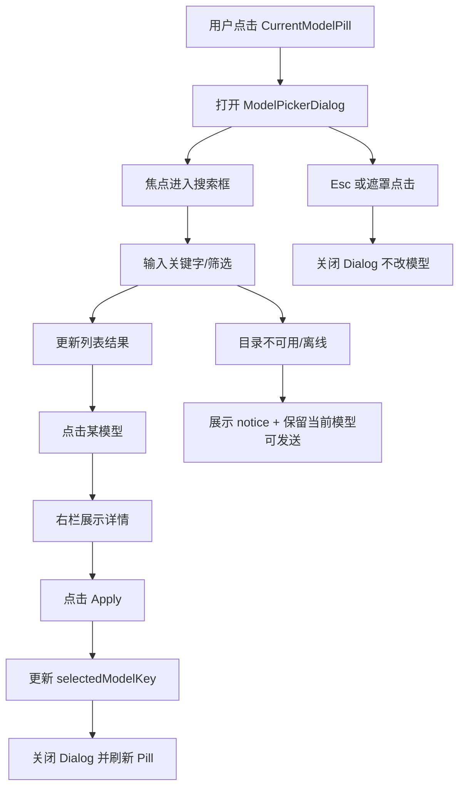

# Model Selector UI 落点侦察与布局原型（阶段 2.1）

## 1. 目标与边界
- 目标：在不改业务链路的前提下，确认模型选择器可无冲突接入现有 UI 架构。
- 边界：本稿只定义落点、状态来源、交互流程和组件拆分，不实现数据同步或发送链路改造。

## 2. 代码侦察结论（落点路径）

### 2.1 输入区域组件层级与容器约束
- 主布局：`src/ui-app/AppChatApp.vue` 通过 `ChatLayout` 组织页面，输入区位于 `#composer` 插槽。
- 容器约束：`src/ui-kit/chat/ChatLayout.vue` 中 `composer` 是固定底部区域，已有上边框，适合追加 selector 入口。
- 输入区实现：`src/ui-app/components/ChatAppComposer.vue`
  - 第一行：`textarea + send/abort`（`flex items-end gap-3`）
  - 第二行：模型/推理控制区（`flex flex-wrap items-center gap-3`）
- 结论：模型选择入口放在“独立第二行”最小侵入；同一行方案会挤压输入框宽度并增加响应式风险。

### 2.2 功能区扩展性（是否可扩展插槽）
- `ChatLayout` 已提供稳定 slot：`header/status/transcript/side/composer`。
- `ChatAppComposer` 已暴露 `v-model:model` 与相关 emit，可在该组件内部新增 `CurrentModelPill` 与 `ModelPickerDialog` 触发，不需要改外层容器结构。

### 2.3 现有弹窗/Drawer/焦点/快捷键
- 现有弹窗为 Modal 形态（遮罩 + 居中容器）：`SettingsModal`、`SearchModal`。
- 关闭行为：`@click.self` + `Escape`（`SettingsModal` 通过 window keydown）。
- 未发现统一 Drawer 基建或统一 focus trap 管理器。
- 快捷键现状：输入区 `Enter` 发送；未发现全局模型选择快捷键。
- 结论：阶段 2 二级界面优先采用 Modal，与现有实现一致；focus 管理由 Dialog 组件内部显式实现。

## 3. 布局决策与备选

### 决策 A：模型选择区域位置
- 推荐：独立一行（放在 composer 第二行，替换/并列现有 model select）。
- 备选：输入区同一行（仅在超宽屏可考虑）。
- 选择理由：
  - 与现有 `ChatAppComposer` 结构一致，改动范围最小。
  - 避免输入框宽度被压缩，减少发送体验回归风险。

### 决策 B：二级界面宽度与小屏折叠
- 推荐桌面策略（>=1024px）：左右两栏。
  - 左栏（列表）`minmax(360px, 42%)`
  - 右栏（详情）`minmax(320px, 58%)`
- 推荐小屏策略（<1024px）：单栏折叠。
  - 默认仅显示左栏列表。
  - 点击模型进入右栏详情“子页”，顶部 `Back` 返回列表。
- 备选：Drawer（右滑面板）。
- 不选 Drawer 的原因：当前仓库无可复用 Drawer/focus 基建，新增成本高且一致性弱。

## 4. 组件树草案
```text
AppChatApp
└─ ChatLayout (#composer)
   └─ ChatAppComposer
      ├─ Row1: MessageInput + SendButton
      └─ Row2: ModelControls
         ├─ CurrentModelPill (new)
         ├─ FavoritesStrip (new, placeholder)
         └─ ModelPickerDialogTrigger (new)

ModelPickerDialog (new, modal)
├─ Header: SearchInput + QuickFilters
├─ Body
│  ├─ LeftPane: ModelList (fts + filters + pagination)
│  └─ RightPane: ModelDetail (capabilities/pricing/context)
└─ Footer: Apply / Cancel
```

## 5. 状态来源与归属
| 状态 | 来源模块 | 建议归属 | 说明 |
| --- | --- | --- | --- |
| `selectedModelKey`（会话当前模型） | `AppChatApp.vue` 的 `model` | 会话态（meta 覆盖） | 阶段 2 仅覆盖会话级选择 |
| `modelCatalogItems` | catalog 查询链路 | 查询结果态 | 作为列表与搜索数据源 |
| `modelCatalogNotice` | catalog 加载逻辑 | UI 提示态 | 离线/回退/未同步提示 |
| `favorites`（占位） | 暂无持久实现 | 本地 UI 态（占位） | 阶段 2 先占位，不阻塞主流程 |
| `pickerOpen` / `activeModelKey` | 新增 UI 组件 | 组件内态 | 管理焦点与详情面板 |

## 6. 交互流程图（草案）


## 7. 最小 UI 元件清单

### 7.1 `CurrentModelPill`
- 作用：显示当前模型、同步状态入口、打开 Picker。
- 最小属性：`modelKey`、`modelDisplayName`、`disabled`、`notice?`。
- 最小事件：`click`（open picker）。

### 7.2 `FavoritesStrip`（占位）
- 作用：展示固定少量快捷模型（阶段 2 可先空实现）。
- 最小属性：`items`、`selectedModelKey`、`disabled`。
- 最小事件：`select(modelKey)`。

### 7.3 `ModelPickerDialog`
- 作用：完成搜索、筛选、浏览详情、确认选择。
- 最小属性：`open`、`models`、`selectedModelKey`、`loading?`、`notice?`。
- 最小事件：`close`、`apply(modelKey)`、`retrySync`（可选）。

## 8. 失败降级与离线行为
- 若 catalog 查询失败：
  - 保留当前 `selectedModelKey`，不阻断发送。
  - Dialog 显示 `modelCatalogNotice` 与重试入口。
- 若无缓存且离线：
  - 列表展示空状态说明；允许关闭并继续使用当前模型。
- 若模型详情缺失：
  - 列表可选中，详情面板降级展示基础字段。

## 9. 依赖模块清单（实现前置）
- 容器与插槽：`src/ui-kit/chat/ChatLayout.vue`
- 输入区挂载：`src/ui-app/components/ChatAppComposer.vue`
- 页面装配：`src/ui-app/AppChatApp.vue`
- 弹窗参考实现：`src/ui-app/components/SearchModal.vue`、`src/ui-app/components/SettingsModal.vue`
- 目录数据类型：`src/next/modelCatalog/modelCatalogTypes`（现有）

## 10. 验收清单（无业务代码）
- [ ] 明确了模型选择 UI 的唯一挂载路径（`ChatAppComposer` 第二行）
- [ ] 明确了二级界面形态（Modal）及桌面/小屏布局策略
- [ ] 给出了组件树、状态来源、交互流程图
- [ ] 给出了最小 UI 元件清单与最小事件契约
- [ ] 给出了离线与失败降级路径，不影响聊天主流程

## 11. Task 2.9 实现约束（落地）

### 11.1 列表虚拟化
- `ModelPickerDialog` 列表采用 `useVirtualWindow`（已有仓库 hook）。
- 配置:
  - `estimatedHeight: 68`
  - `overscan: 10`
- 目标:
  - 目录规模不可控时保持滚动与键盘导航流畅。

### 11.2 Debounce 与请求取消
- 搜索/筛选变更使用固定防抖: `250ms`（可通过组件参数覆盖，测试可设为 `0`）。
- 取消策略:
  - 采用请求序号（`querySeq`）丢弃过期响应结果，
  - 不依赖网络层 abort，确保 UI 状态不会被旧请求覆盖。

### 11.3 键盘与交互
- `Esc`: 关闭弹窗（不改当前模型）。
- `ArrowUp` / `ArrowDown`: 在结果列表中移动活动项。
- `Enter`: 选中活动项（单击等效），触发:
  1. `select(modelId)`
  2. `close`
- 单击列表项:
  - 立即选中并关闭弹窗，
  - 回填当前模型显示（`CurrentModelPill`）。

### 11.4 空态与错误态
- 查询为空:
  - 右侧列表显示 `No models found for current search/filter.`。
- 查询失败:
  - 左侧状态区域显示错误文案，
  - 仍允许用户关闭弹窗并继续聊天主流程。
- notice:
  - 优先展示 query notice，并与外层 notice 合并显示。

### 11.5 Endpoints 详情（任务卡 2.11）
- `ModelPickerDialog` 右侧新增 `EndpointDetailPanel`：
  - 首次查看某模型详情时按需请求 `GET /api/v1/models/:author/:slug/endpoints`。
  - 显示 `fetchedAt` 时间与手动 `Refresh` 按钮。
- 双层缓存策略：
  - 稳定字段（provider/tag/quantization/max tokens/参数集）写入 `endpoint_meta` 落盘。
  - 波动性能字段（uptime/latency/throughput）仅保留内存缓存。
  - 非强制刷新场景优先读缓存；只有手动刷新触发重新拉取。
- 降级约束：
  - endpoints 拉取失败仅影响详情面板提示，不影响模型选择与发送主路径。

## 12. Stage 4 Endpoints Tab Controls（任务卡 4.8）
- Endpoints 页签新增本地筛选/排序控件：
  - 筛选：`provider_name`、`tag`、`quantization`、`supports_implicit_caching`、`supported_parameters`、`status`、`uptime >= threshold`
  - 排序：`latency p50/p99`、`throughput p50/p99`、`uptime`
- 语义约束：
  - 这些控件仅影响页签内 endpoint 展示顺序和可见项。
  - 不影响会话发送模型、也不改变实际路由策略（路由后置阶段处理）。
